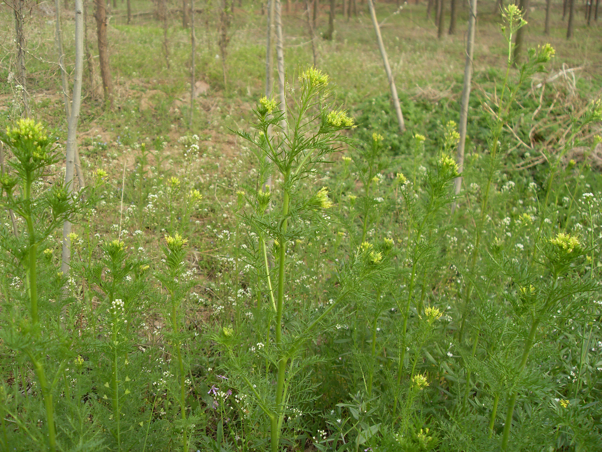

## 播娘蒿

---

**拉丁名:**  _Descurainia sophia (Linn.) Webb.ex Prantl_

**科 属:** 十字花科 播娘蒿属

**别 名:** 米蒿

**原产地:** 不详

**形  态:** 一年生或两年生直立草本，高20～80厘米，茎上部分分枝，密被白色卷毛或分歧状短毛。叶2～3回羽状全裂，长2～15厘米，末回羽片线形或长圆形，下部叶有柄，上部叶无柄。总状花序，花淡黄色，直径约2毫米。长角果串珠状，黄绿色，长2～3厘米，直径约1毫米，斜上而稍内弯；种子1裂，暗褐色，椭圆形或长圆形。花期4～5月，果期6月。

**西大分布地:** 常见杂草，见于三校区各处草丛。

**备注:** 2009年4月6日摄于西北大学南校区待开发区。

.JPG) 

 

