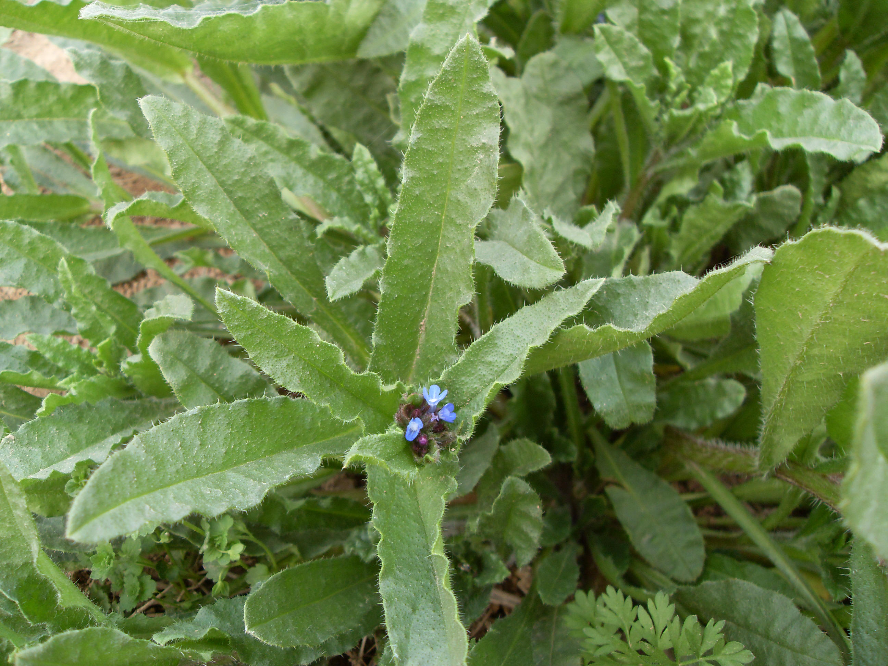

## 斑种草

---

**拉丁名:**  _Bothriospermum chinense Bge_

**科 属:** 紫草科 斑种草属

**别 名:** 猫舌头草
【形  态】一年生草本。茎由基部分枝，细弱斜上，高20～40厘米。
 茎叶密被刚毛，基生叶有柄，茎生叶互生，长圆形至倒披针形，缘
 部波状皱起。总状花序顶生，有苞片，卵形或狭卵形；花冠淡蓝色，
 直径5毫米，裂片5，钝圆，喉部有5个附属物。小坚果，肾形。花期
 4～5月，果期5～7月。
【西大分布地】仅见于西北大学南校区待开发区草丛中。
备注：
    2009年4月6日摄于西北大学南校区待开发区草丛中。

**原产地:** 斑种草
详细资料： 首页 下一页 上一页 
【拉丁名】Bothriospermum chinense Bge.
【科 属】紫草科 斑种草属
【别 名】猫舌头草

**形  态:** 一年生草本。茎由基部分枝，细弱斜上，高20～40厘米。茎叶密被刚毛，基生叶有柄，茎生叶互生，长圆形至倒披针形，缘部波状皱起。总状花序顶生，有苞片，卵形或狭卵形；花冠淡蓝色，直径5毫米，裂片5，钝圆，喉部有5个附属物。小坚果，肾形。花期4～5月，果期5～7月。

**西大分布地:** 仅见于西北大学南校区待开发区草丛中。

**备注:** 2009年4月6日摄于西北大学南校区待开发区草丛中。

.JPG) 

.JPG) 

.JPG) 

 

