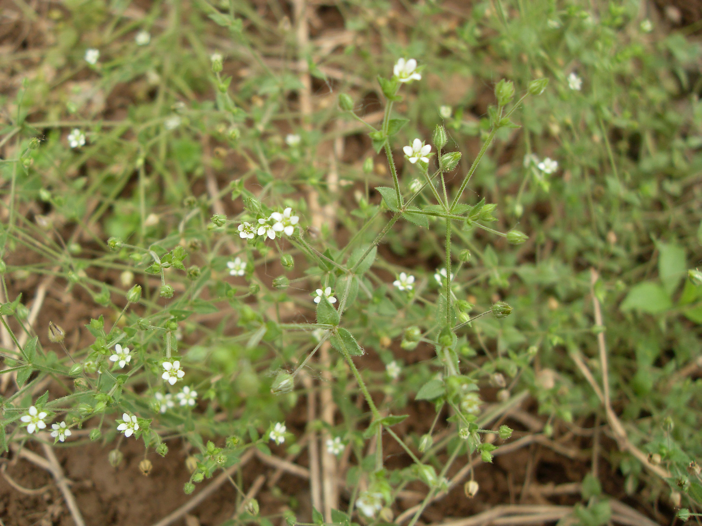

## 无心菜

---

**拉丁名:**  _Arenaria serpyllifolia Linn _

**科 属:** 石竹科 无心菜属

**别 名:** 蚤缀

**原产地:** 不详

**形  态:** 一年生或两年生草本，高10～30厘米。茎自基部分支，枝下部平铺，上部直立或丛生，密生白色短柔毛。叶小，圆卵形，先端尖锐，基部略圆。聚伞花序，花柄细，直立，密生柔毛；花瓣5，倒卵形，白色。蒴果卵形，熟时6裂。种子肾形，微细，淡褐色。花期4～5月，果期6～7月。

**西大分布地:** 常见杂草，仅见于南校区草丛。

**备注:** 2009年5月17日摄于西北大学南校区北门附近。

.JPG) 

 

