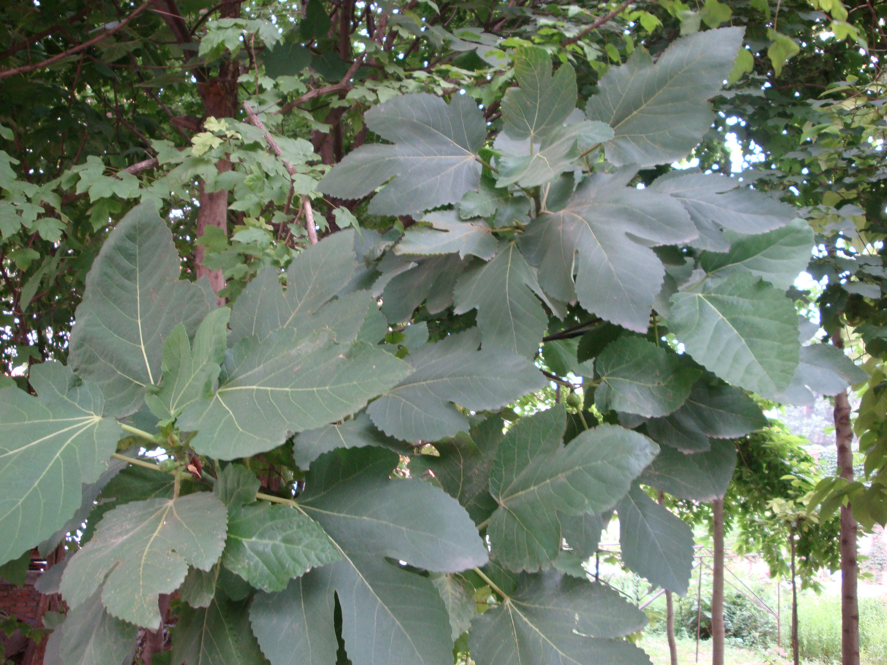
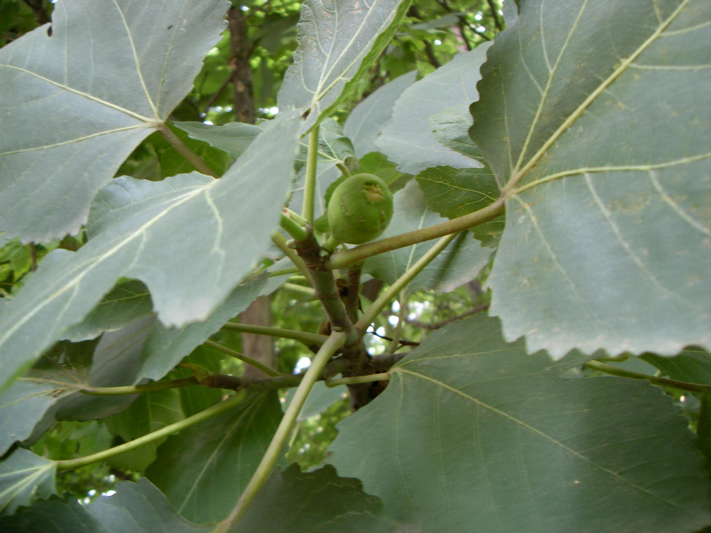

## 无花果

---

**拉丁名:**  _Ficus carica Linn _

**科 属:** 桑科 榕属

**别 名:** 奶浆果、蜜果
 【原产地】地中海沿岸
 【形  态】落叶小乔木，高可达10米，或成灌木状。小枝粗壮
  。叶广卵形或近圆形，长10～20厘米，常3～5掌状裂，边缘
  波状或成粗齿，表面粗糙，背面有柔毛。隐花果梨形，长5～
  8厘米，绿黄色。
 【西大分布地】北校区见于西大花园内。
备注：
    2009年7月28日摄于西北大学北校区西大花园内。

**原产地:** 地中海沿岸
【形 态】落叶小乔木，高可达10米，或成灌木状。小枝粗壮
 。叶广卵形或近圆形，长10～20厘米，常3～5掌状裂，边缘
 波状或成粗齿，表面粗糙，背面有柔毛。隐花果梨形，长5～
 8厘米，绿黄色。
【西大分布地】北校区见于西大花园内。
备注：
 2009年7月28日摄于西北大学北校区西大花园内。

**形  态:** 落叶小乔木，高可达10米，或成灌木状。小枝粗壮。叶广卵形或近圆形，长10～20厘米，常3～5掌状裂，边缘波状或成粗齿，表面粗糙，背面有柔毛。隐花果梨形，长5～8厘米，绿黄色。

**西大分布地:** 北校区见于西大花园内。

**备注:** 2009年7月28日摄于西北大学北校区西大花园内。

 

 

