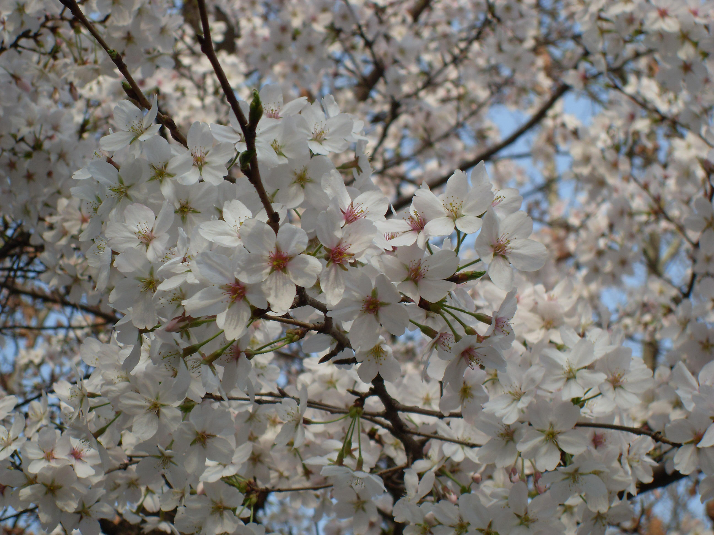

## 日本早樱

---

**拉丁名:**  _Prunus subhirtella Miq_

**科 属:** 蔷薇科 樱属

**别 名:** 樱花

**原产地:** 日本

**形  态:** 小乔木，高约5m，树皮横纹状，老树皮纵裂。小枝褐色，叶倒卵形至卵状披针形。花先叶开放。花蕾粉色，卵圆形；花粉白色，花瓣5枚，花瓣尖内凹，花瓣边缘有红晕，花径1.8～2.2厘米；雌蕊1个，雄蕊散射，有长有短，长的雄蕊略长于花瓣，花丝浅紫红色；；花萼浅紫褐色，筒型有毛，萼5片，顶略尖，花梗长约0．5cm，有毛；花2～3朵一束，稀1朵；花谢后花瓣脱落，但花丝还能宿存几天，远望之如红云一片。花期3月，单花花期7天。　　

**西大分布地:** 仅见于北校区大草坪东南侧。 

**备注:** 上图为日本早樱花枝，2009年3月19日摄于西北大学北校区大草坪东南侧；左图为日本早樱果实，2009年5月25日摄于西北大学北校区大草坪东南侧。

 

