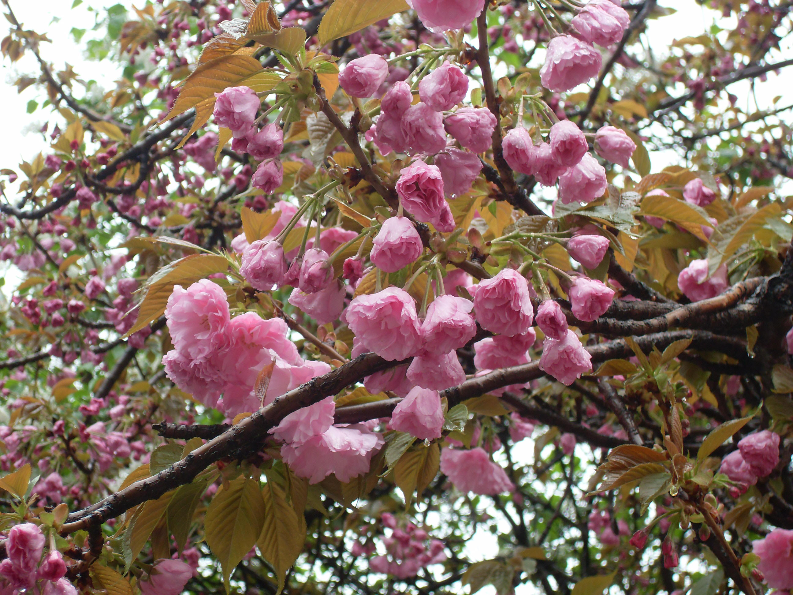
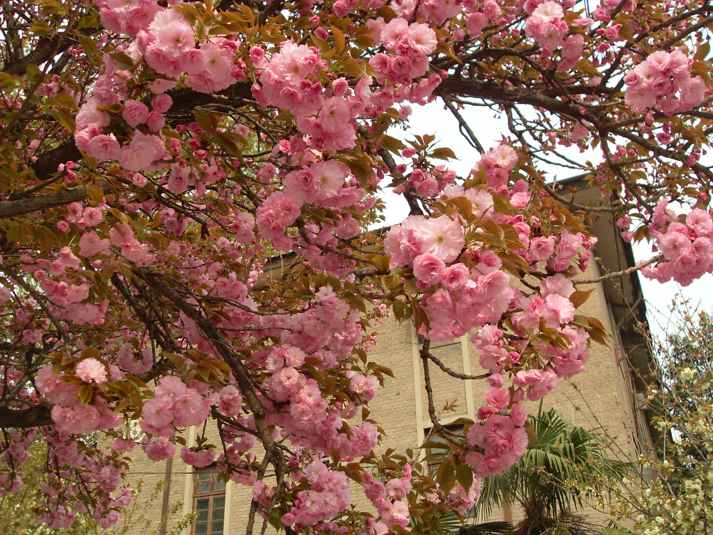
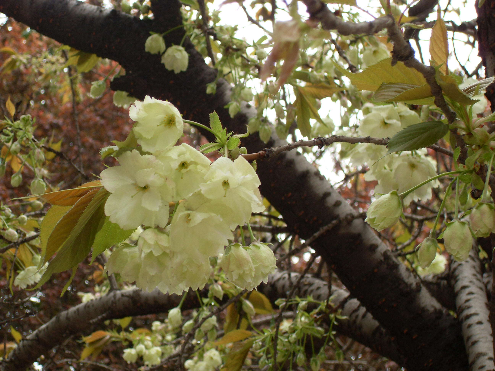

## 日本晚樱

---

**拉丁名:**  _Prunus lannesiana Wils _

**科 属:** 蔷薇科 樱属

**别 名:** 江户樱花

**原产地:** 日本

**形  态:** 落叶乔木，高达10米。干皮淡灰色，较粗糙；小枝较粗长而开展，无毛。叶常倒卵形，长5～15厘米，宽3～8厘米，叶端渐尖，呈长尾状，叶缘锯齿单一或重锯齿，齿端有长芒，叶柄上有一对腺体，叶柄长1～2.5厘米；新叶无毛，略带红褐色。花型大而芳香，单瓣或重瓣，常下垂，粉红或近白色1～5朵排成伞房花序，小苞片叶状，无毛；花之总梗短，花梗长1.5～2厘米；花瓣端凹形；花期长，4月中下旬开放。果卵形，熟时黑色，有光泽。　

**西大分布地:** 北校区见于七号教学楼东侧行道及文博学院东侧行道两侧； 南校区见于 桃园校区见于 

**备注:** 上图为日本晚樱的一个粉红花色品种，摄于2009年3月28日西北大学北校区七号教学楼东侧。左图为日本晚樱的一个绿色花品种，摄于2009年3月28日西北大学北校区文博学院东侧。

 

 

 

