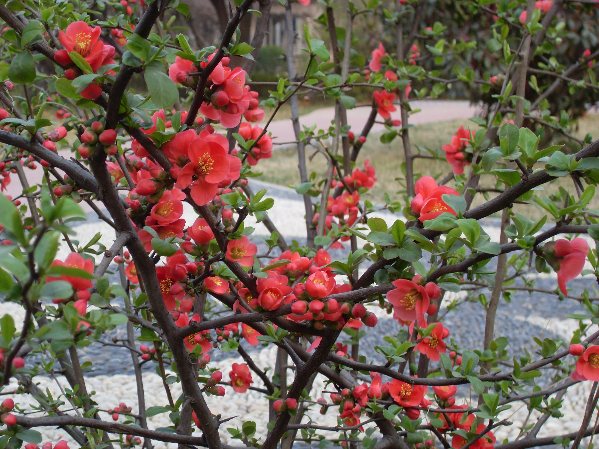

## 日本贴梗海棠

---

**拉丁名:**  _Chaenomeles japonica Lindl_

**科 属:** 蔷薇科 木瓜属

**别 名:** 倭海棠、日本贴梗海棠

**原产地:** 日本

**形  态:** 落叶矮灌木，通常高不及1米。枝开展有刺；小枝粗糙，幼时具绒毛，紫红色，两年生枝有疣状突起，黑褐色。叶广卵形至带卵形或匙形，长3～5厘米，先端钝或短急尖，缘具圆钝锯齿，两面无毛。花3～5朵簇生，砖红色。果近球形，径3～4厘米，黄色。花期3～4月，果期9～10月。

**西大分布地:** 北校区见于七号教学楼东侧草坪内。　

**备注:** 2008年3月17日摄于西北大学北校区七号教学楼东侧草坪内。

 

