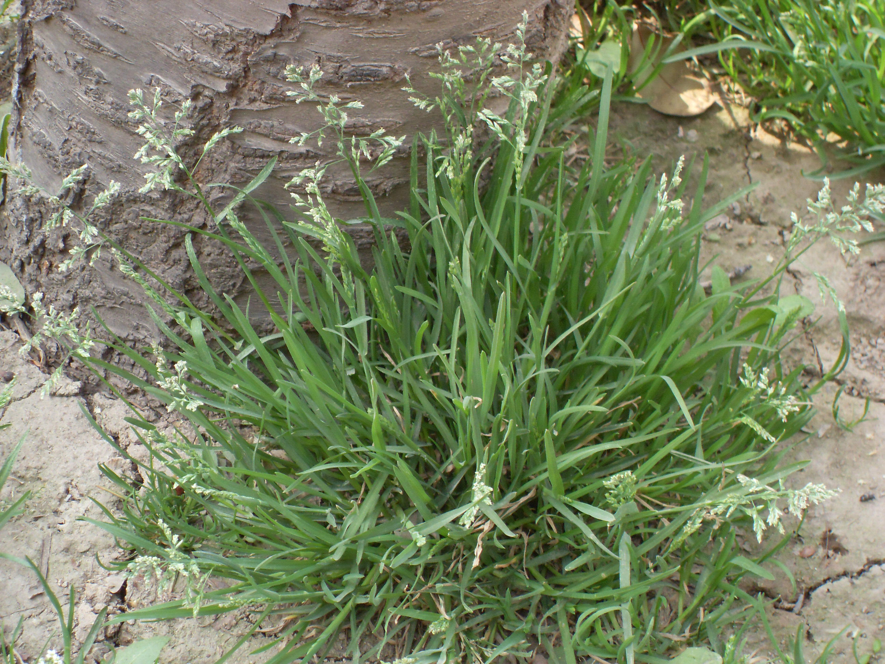

## 早熟禾

---

**拉丁名:**  _Poa annua Linn_

**科 属:** 禾本科 早熟禾属

**别 名:** 小青草、绒球草
【形  态】一年生越年生草本，秆细弱，丛生，长高6～30
 厘米。叶鞘柔软，中部以下闭合；叶舌膜质，长1～2毫米
 ；叶片长2～12厘米，宽1～4毫米。圆锥花序开展，卵圆
 形，长3～7厘米；小穗绿色，含3～6朵小花，长3～6毫米
 颖果纺锤形，长约2毫米。花期3～4月，果期5～7月。
【西大分布地】早春常见杂草，三校区均常见。
备注：
    2009年3月19日摄于西北大学北校区学生宿舍区树下。

**原产地:** 早熟禾
详细资料： 首页 下一页 上一页
【拉丁名】Poa annua Linn.
【科 属】禾本科 早熟禾属
【别 名】小青草、绒球草

**形  态:** 一年生越年生草本，秆细弱，丛生，长高6～30厘米。叶鞘柔软，中部以下闭合；叶舌膜质，长1～2毫米；叶片长2～12厘米，宽1～4毫米。圆锥花序开展，卵圆形，长3～7厘米；小穗绿色，含3～6朵小花，长3～6毫米颖果纺锤形，长约2毫米。花期3～4月，果期5～7月。

**西大分布地:** 早春常见杂草，三校区均常见。

**备注:** 2009年3月19日摄于西北大学北校区学生宿舍区树下。

 

