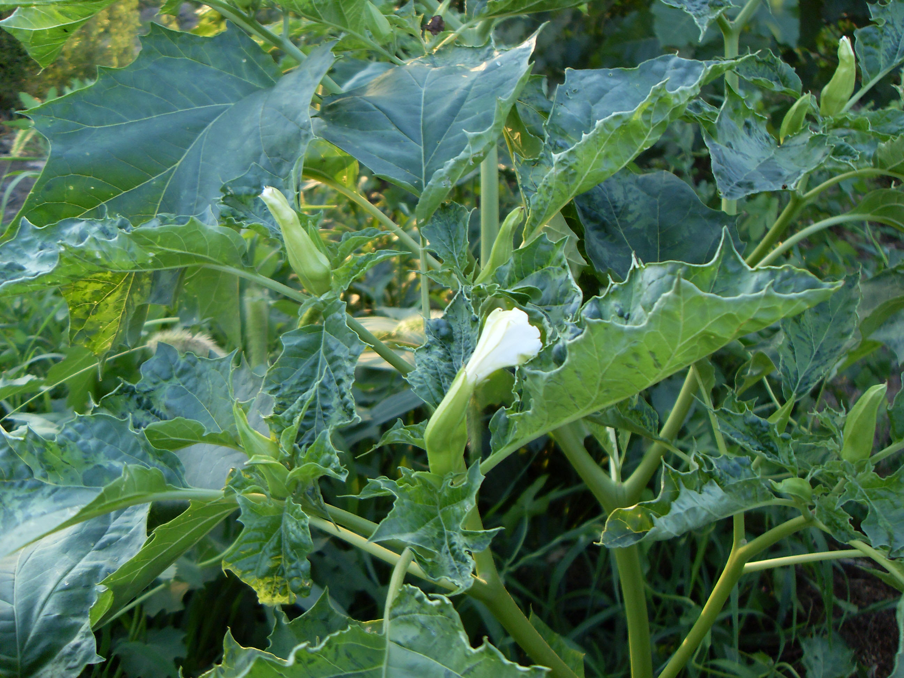

## 曼陀罗

---

**拉丁名:**  _Datura stramonium Linn _

**科 属:** 茄科 曼陀罗属

**别 名:** 醉心花、狗核桃、洋金花
 【原产地】印度等热带地区
 【形  态】草本或半灌木状，高0.5～1.5米全体近于平滑
  ，茎粗壮，下部木质化。叶广卵形，先端渐尖，基部不对
  称楔形，边缘有不规则波状浅裂，裂片顶端急尖。花单生
  于枝杈间或叶腋，直立；花冠漏斗状，5浅裂，白色；花有
  香味。蒴果直立，卵形，表面生有针状硬刺。种子卵圆形，
  稍扁，黑色。花期6～10月，果期7～11月。
【西大分布地】见于南校区杂草丛中。
备注：
    2009年7月27日摄于西北大学南校区垃圾处理站附近。
　

**原产地:** 印度等热带地区
【形 态】草本或半灌木状，高0.5～1.5米全体近于平滑
 ，茎粗壮，下部木质化。叶广卵形，先端渐尖，基部不对
 称楔形，边缘有不规则波状浅裂，裂片顶端急尖。花单生
 于枝杈间或叶腋，直立；花冠漏斗状，5浅裂，白色；花有
 香味。蒴果直立，卵形，表面生有针状硬刺。种子卵圆形，
 稍扁，黑色。花期6～10月，果期7～11月。
【西大分布地】见于南校区杂草丛中。
备注：
 2009年7月27日摄于西北大学南校区垃圾处理站附近。
　

**形  态:** 草本或半灌木状，高0.5～1.5米全体近于平滑，茎粗壮，下部木质化。叶广卵形，先端渐尖，基部不对称楔形，边缘有不规则波状浅裂，裂片顶端急尖。花单生于枝杈间或叶腋，直立；花冠漏斗状，5浅裂，白色；花有香味。蒴果直立，卵形，表面生有针状硬刺。种子卵圆形，稍扁，黑色。花期6～10月，果期7～11月。

**西大分布地:** 见于南校区杂草丛中。

**备注:** 2009年7月27日摄于西北大学南校区垃圾处理站附近。　

.JPG) 

 

