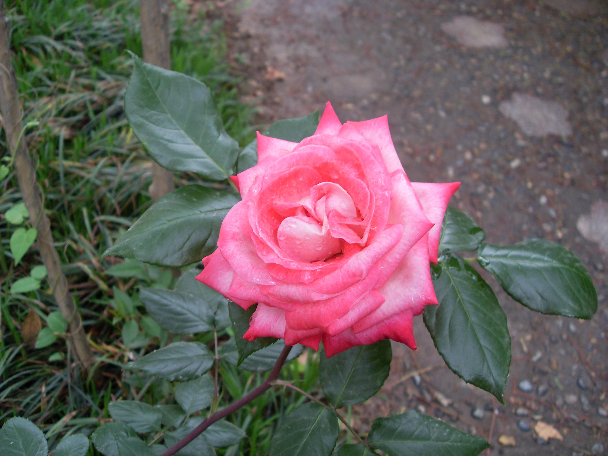

## 月季

---

**拉丁名:**  _Rosa chinensis Jacq_

**科 属:** 蔷薇科 蔷薇属

**别 名:** 月月红

**原产地:** 原种产于中国

**形  态:** 直立灌木，高约1.5米。小枝有短粗的钩状刺或无。小叶3～7，卵形或长卵形，长2～6厘米，宽1～3厘米，先端渐尖，基部阔楔形或近圆形，边缘有锐锯齿，叶柄、叶轴及托叶的边缘均有腺毛。花常数多簇生，花梗长短不一，具腺毛；花红色或玫瑰色，直径5厘米，萼裂片联系，羽裂。聚合果卵圆形或梨形，红色。花期4～10月，果期6～11月。

**西大分布地:** 三校区常见观赏花卉见于各处。

**备注:** 2009年5月4日摄于西北大学北校区西大花园内。

 

