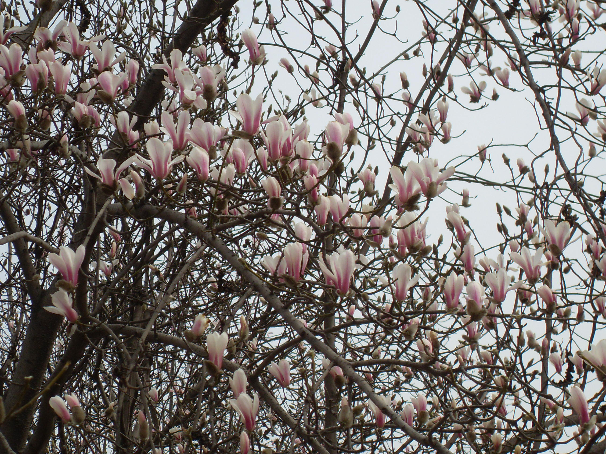
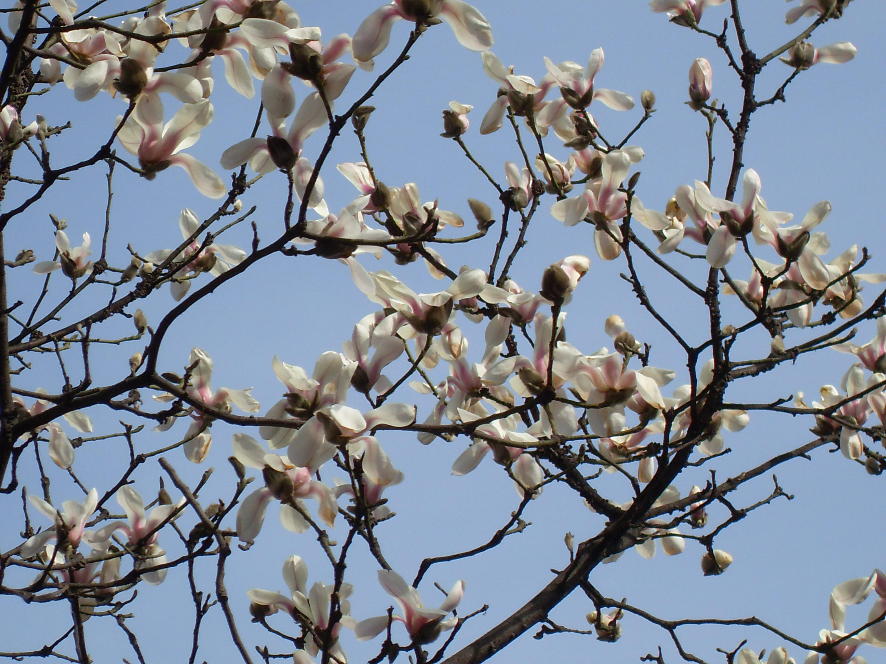
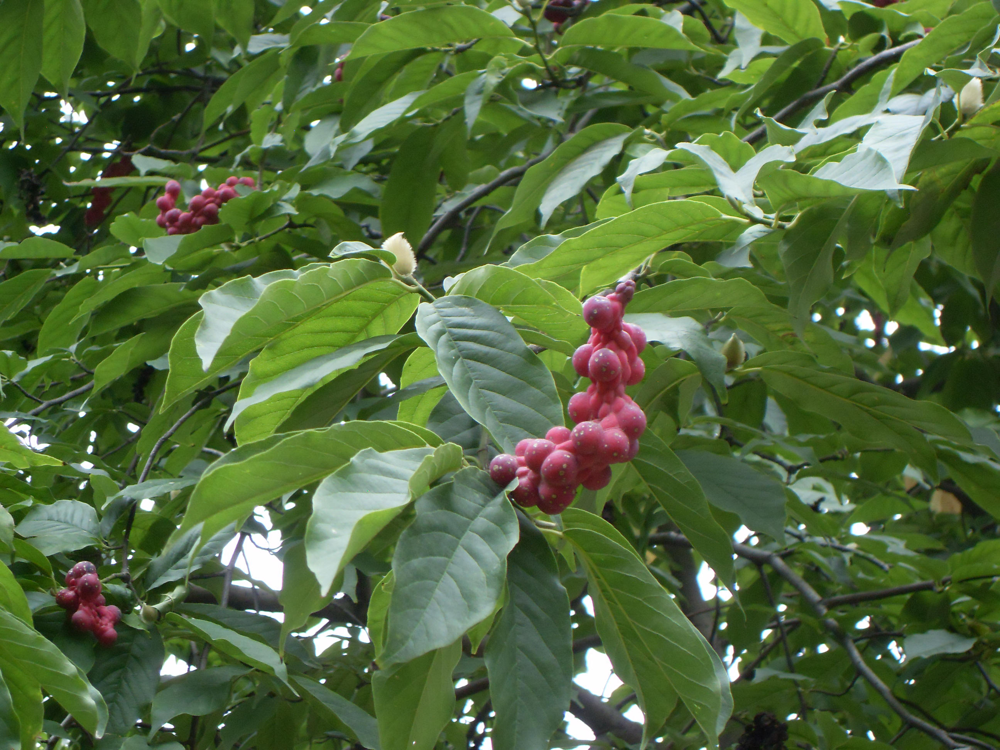

## 望春玉兰

---

**拉丁名:**  _Magnolia biondii Pampan_

**科 属:** 木兰科 木兰属

**别 名:** 望春花、迎春树、辛兰

**原产地:** 中国中部

**形  态:** 落叶乔木，高达12米；树皮淡灰色，光滑；小枝细长，灰绿色，无毛。叶椭圆状披针形、卵状披针形，长10～18厘米，宽3.5～6.5厘米，先端急尖或短渐尖，基部阔楔形或圆钝。花先叶开放，直径6～8厘米，芳香；花被9，外轮3片紫红色近狭倒卵状条形，长约1厘米，中内两轮近匙形，白色，外面基部紫红色。聚合果圆柱形，熟时红色，长8～14厘米。种子心形，外种皮鲜红色。花期3月，果期9月。　　

**西大分布地:** 仅见于北校区图书馆前行道北侧。

**备注:** 望春玉兰详细资料：首页下一页上一页【拉丁名】MagnoliabiondiiPampan【科属】木兰科木兰属【别名】望春花、迎春树、辛兰【原产地】中国中部【形态】落叶乔木，高达12米；树皮淡灰色，光滑；小枝细长，灰绿色，无毛。叶椭圆状披针形、卵状披针形，长10～18厘米，宽3.5～6.5厘米，先端急尖或短渐尖，基部阔楔形或圆钝。花先叶开放，直径6～8厘米，芳香；花被9，外轮3片紫红色近狭倒卵状条形，长约1厘米，中内两轮近匙形，白色，外面基部紫红色。聚合果圆柱形，熟时红色，长8～14厘米。种子心形，外种皮鲜红色。花期3月，果期9月。　　【西大分布地】仅见于北校区图书馆前行道北侧。备注:上图为望春玉兰花枝，2009年3月6日摄于西北大学北校区图书馆前行道北侧；左图为望春玉兰果实，2009年8月21日摄于西北大学北校区图书馆前行道北侧。　

 

 

 

