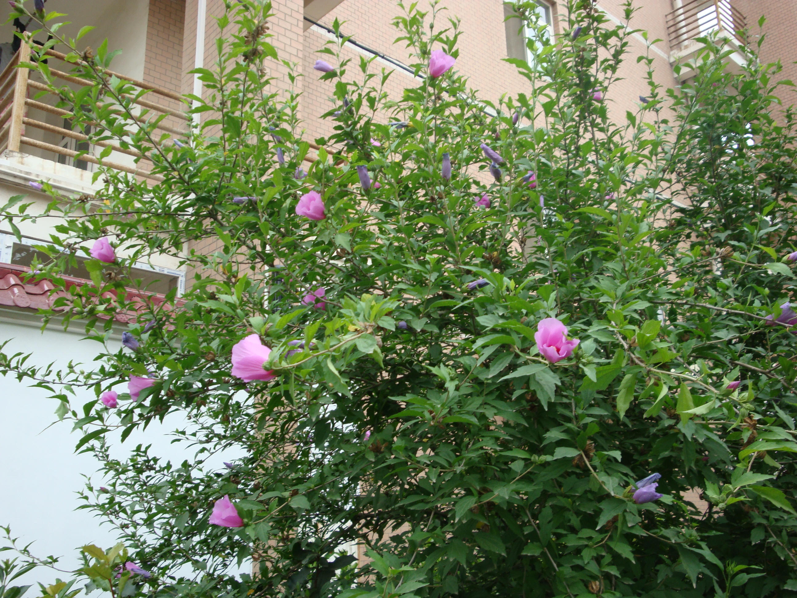

## 木槿

---

**拉丁名:**  _Hibiscus syriacus Linn _

**科 属:** 锦葵科 木槿属

**别 名:** 朝开幕落花、篱障花
 【原产地】中国、印度
 【形  态】落叶灌木或小乔木，高3～6米，小枝幼时密被
   绒毛，后渐脱落，叶菱形卵状，长3～6厘米，基部楔形，
   端部长三列，边缘有钝齿，仅背面脉上稍有毛；叶柄长
   0.5～2.5厘米。花单生叶腋，径5～8厘米，单瓣或复瓣
  ，有淡紫、红、白等色。蒴果卵圆形，径约1.5厘米，密
  生星状绒毛。花期6～9月，果期9～11月。
 【西大分布地】南校区见于学生宿舍区。
备注：
    2009年6月17日摄于南校区见于学生宿舍区。

**原产地:** 中国、印度
【形 态】落叶灌木或小乔木，高3～6米，小枝幼时密被
 绒毛，后渐脱落，叶菱形卵状，长3～6厘米，基部楔形，
 端部长三列，边缘有钝齿，仅背面脉上稍有毛；叶柄长
 0.5～2.5厘米。花单生叶腋，径5～8厘米，单瓣或复瓣
 ，有淡紫、红、白等色。蒴果卵圆形，径约1.5厘米，密
 生星状绒毛。花期6～9月，果期9～11月。
【西大分布地】南校区见于学生宿舍区。
备注：
 2009年6月17日摄于南校区见于学生宿舍区。

**形  态:** 落叶灌木或小乔木，高3～6米，小枝幼时密被绒毛，后渐脱落，叶菱形卵状，长3～6厘米，基部楔形，端部长三列，边缘有钝齿，仅背面脉上稍有毛；叶柄长0.5～2.5厘米。花单生叶腋，径5～8厘米，单瓣或复瓣，有淡紫、红、白等色。蒴果卵圆形，径约1.5厘米，密生星状绒毛。花期6～9月，果期9～11月。

**西大分布地:** 南校区见于学生宿舍区。

**备注:** 2009年6月17日摄于南校区见于学生宿舍区。

.JPG) 

 

