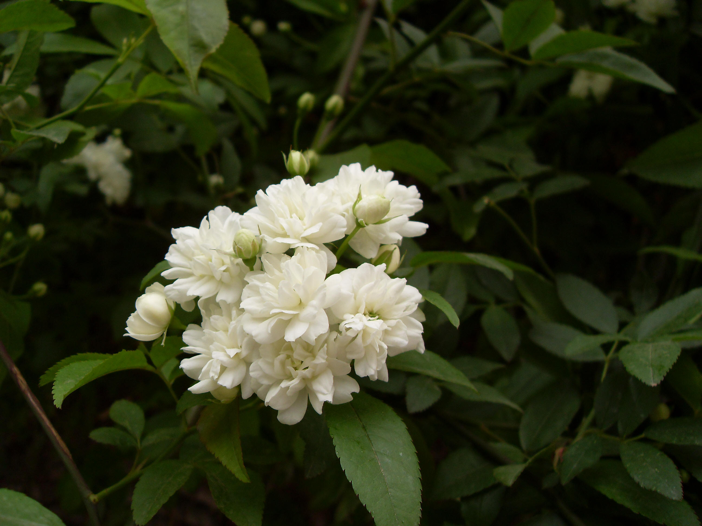
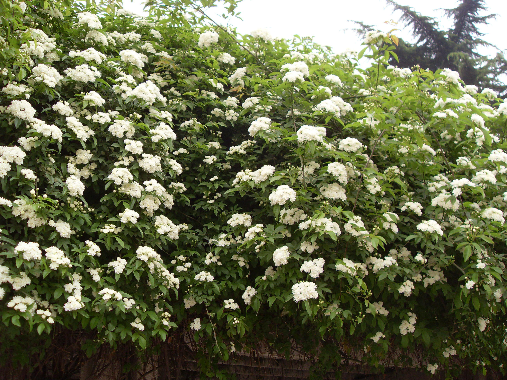

## 木香

---

**拉丁名:**  _Rose banksiae Ait_

**科 属:** 蔷薇科 蔷薇属

**别 名:** 木香藤

**原产地:** 中国西南部

**形  态:** 半常绿攀援灌木。树皮红褐色，薄条状剥落。小枝绿色，近无刺。奇数羽状复叶，小叶3～5枚，椭圆状卵形，边缘有细锯齿。花白色或近黄色，径约2.5厘米，芳香，花3～15朵排成伞形花序，果近球形，熟时红色，径约3～4毫米。花期4～5月，果期9～10月。

**西大分布地:** 仅见于北校区西门口花坛及生命科学学院南面木香园。

**备注:** 木香详细资料：首页下一页上一页【拉丁名】RosebanksiaeAit.【科属】蔷薇科蔷薇属【别名】木香藤【原产地】中国西南部【形态】半常绿攀援灌木。树皮红褐色，薄条状剥落。小枝绿色，近无刺。奇数羽状复叶，小叶3～5枚，椭圆状卵形，边缘有细锯齿。花白色或近黄色，径约2.5厘米，芳香，花3～15朵排成伞形花序，果近球形，熟时红色，径约3～4毫米。花期4～5月，果期9～10月。【西大分布地】仅见于北校区西门口花坛及生命科学学院南面木香园。备注:2009年4月10日摄于西北大学北校区西门口花坛。　

 

 

