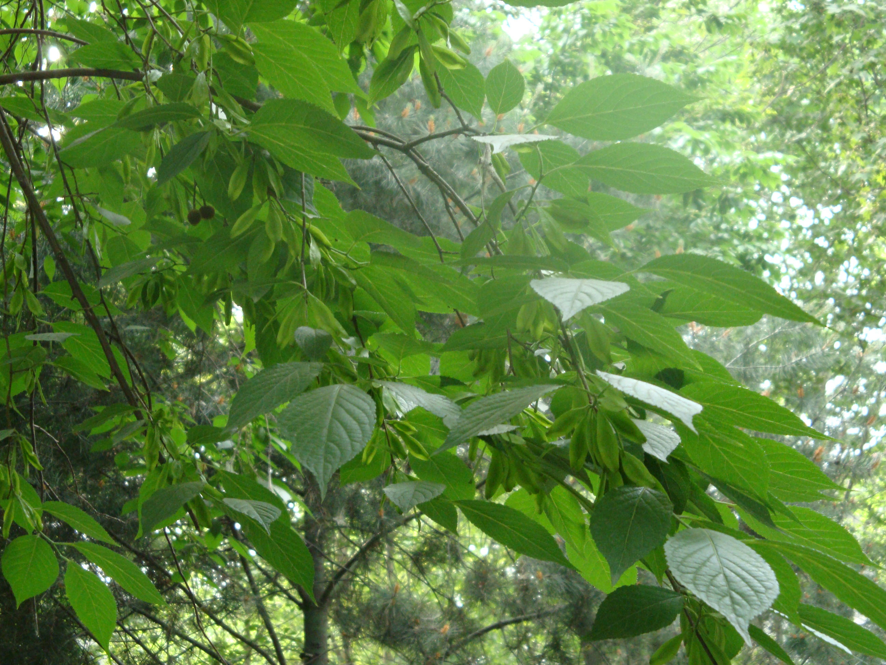

## 杜仲

---

**拉丁名:**  _Eucommia ulmoides Oliv_

**科 属:** 杜仲科 杜仲属

**别 名:** 丝棉皮

**原产地:** 中国

**形  态:** 落叶乔木，高达20米。小枝光滑，黄褐色或较淡，具片状髓。皮、枝及叶均含胶质。单叶互生；椭圆形或卵形，长7～15厘米，宽3.5～6.5厘米，先端渐尖，基部广楔形，边缘有锯齿，幼叶上面疏被柔毛，下面毛较密，老叶上面光滑，下面叶脉处疏被毛；叶柄长1～2厘米。花单性，雌雄异株，与叶同时开放，或先叶开放，生于一年生枝基部苞片的腋内，有花柄；无花被；翅果卵状长椭圆形而扁，先端下凹，内有种子1粒。花期4～5月。果期9月。

**西大分布地:** 仅见于北校区地质系前树林东侧及地质系后草坪。

**备注:** 2009年5月4日摄于西北大学北校区地质系前树林东侧。

 

