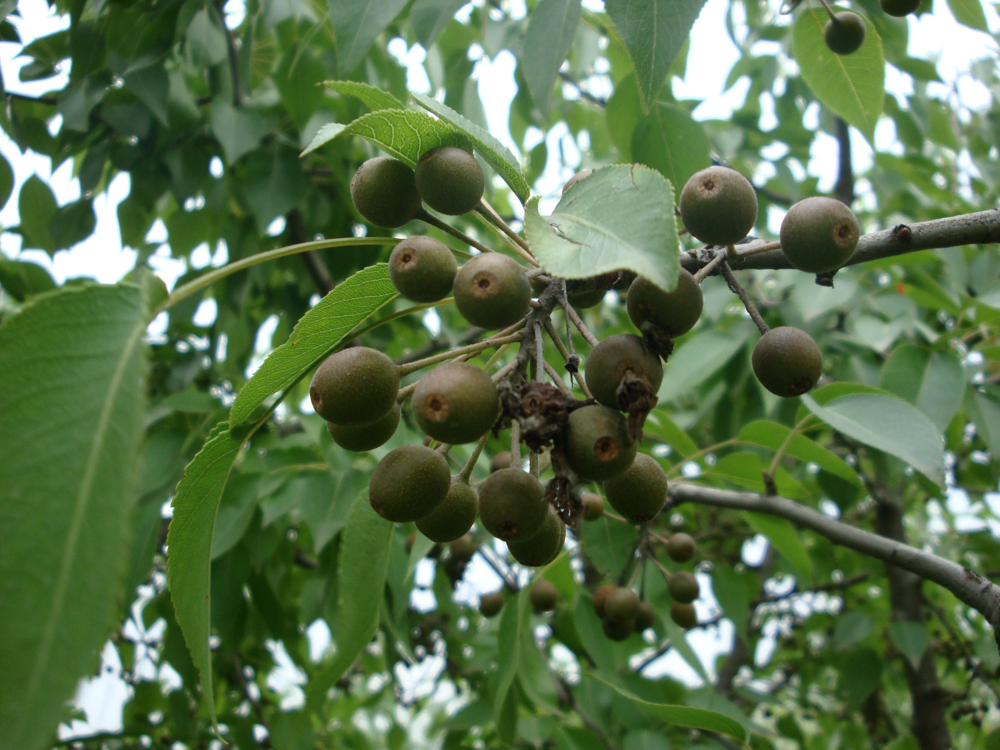
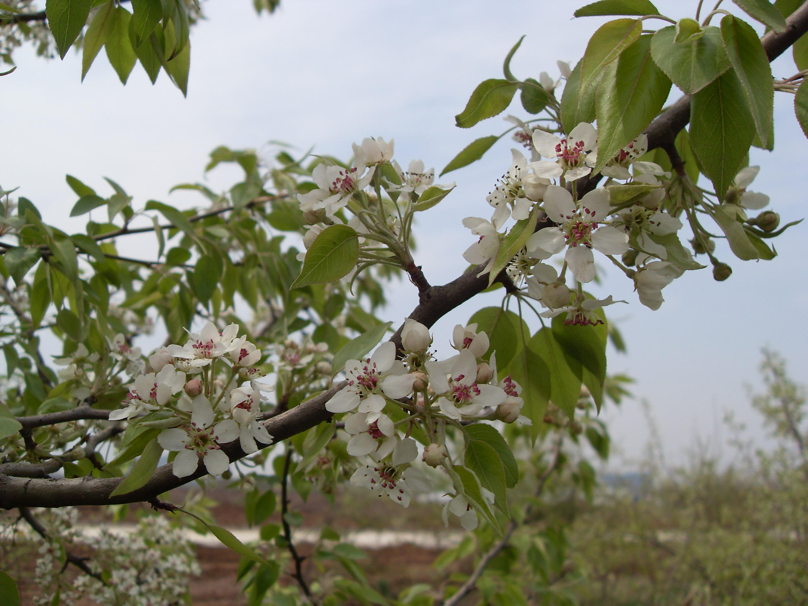

## 杜梨

---

**拉丁名:**  _Pyrus betulaefolia Bge _

**科 属:** 蔷薇科 梨属

**别 名:** 海棠梨、土梨、野梨子
 【原产地】中国 
 【形  态】落叶乔木，高达10米。枝常有刺，小枝嫩是密被灰白色
  绒毛，两年生枝条近于无毛，紫褐色。叶片菱状卵形至长圆卵形，
  长4～8厘米，宽2.5～3.5厘米，基部阔楔形，便缘有尖锐锯齿。伞
  形总状花序，有花10～15朵，花直径1.5～2厘米，花瓣卵形，白色 
  。梨果近球形，直径0.5～1厘米，褐色，有淡色斑点。花期4月，果
  期8～9月。
　
　
　
                                                                       【西大分布地】见于南校区待开发校园区。  
                                                                        备注：
                                                                            上图为杜梨花枝，2009年3月29日摄于西北大学南校区待开发校园区；
                                                                            左图为杜梨果实，2009年6月17日摄于西北大学南校区待开发校园区。

**原产地:** 中国 
 【形 态】落叶乔木，高达10米。枝常有刺，小枝嫩是密被灰白色
绒毛，两年生枝条近于无毛，紫褐色。叶片菱状卵形至长圆卵形，
长4～8厘米，宽2.5～3.5厘米，基部阔楔形，便缘有尖锐锯齿。伞
形总状花序，有花10～15朵，花直径1.5～2厘米，花瓣卵形，白色 
 。梨果近球形，直径0.5～1厘米，褐色，有淡色斑点。花期4月，果
 期8～9月。
　
　
　
 【西大分布地】见于南校区待开发校园区。 
 备注：
 上图为杜梨花枝，2009年3月29日摄于西北大学南校区待开发校园区；
 左图为杜梨果实，2009年6月17日摄于西北大学南校区待开发校园区。

**形  态:** 落叶乔木，高达10米。枝常有刺，小枝嫩是密被灰白色绒毛，两年生枝条近于无毛，紫褐色。叶片菱状卵形至长圆卵形，长4～8厘米，宽2.5～3.5厘米，基部阔楔形，便缘有尖锐锯齿。伞形总状花序，有花10～15朵，花直径1.5～2厘米，花瓣卵形，白色。梨果近球形，直径0.5～1厘米，褐色，有淡色斑点。花期4月，果期8～9月。　　　

**西大分布地:** 见于南校区待开发校园区。  

**备注:** 上图为杜梨花枝，2009年3月29日摄于西北大学南校区待开发校园区；左图为杜梨果实，2009年6月17日摄于西北大学南校区待开发校园区。

 

.JPG) 

 

