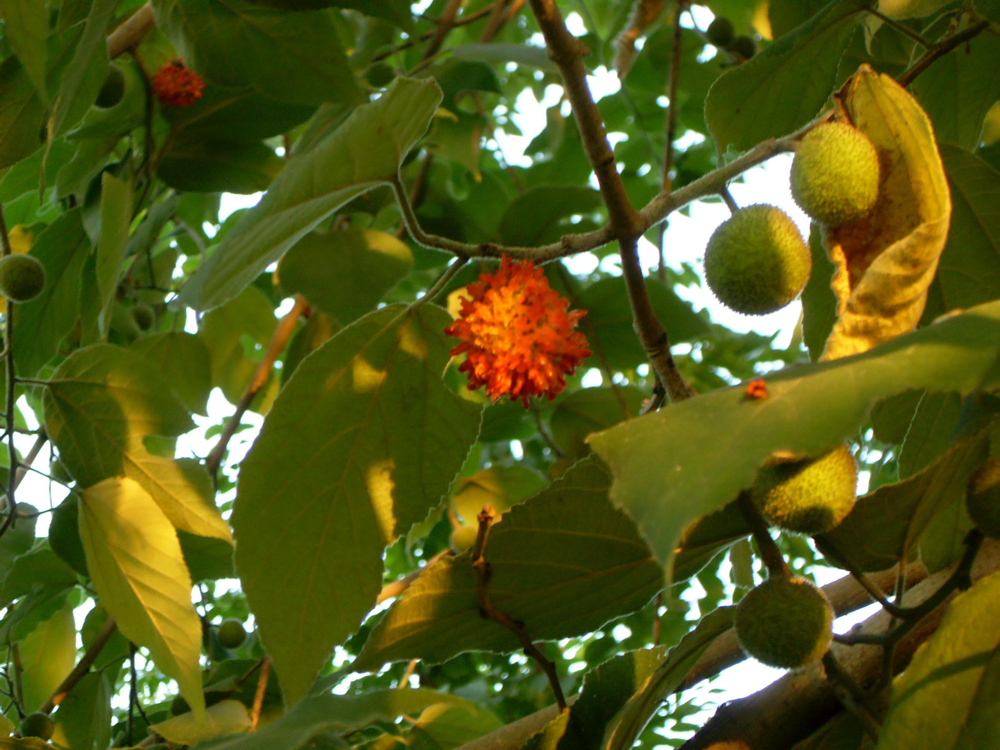

## 构树

---

**拉丁名:**  _Broussonetia papyifera (Linn.) L'Hert. ex Vent _

**科 属:** 桑科 构属

**别 名:** 构桃树
 【原产地】亚洲
 【形  态】落叶乔木，高达16米。树皮浅灰色，不易裂
  。小枝密被丝状刚毛。叶互生，卵形，长7～20厘米，
  先端渐尖，基部圆形或近心形，缘有锯齿，两面密生
  柔毛。聚合果球形，直径2～2.5厘米，熟时橙红色。花
  期4～5月，果期7～9月。
 【西大分布地】北校区见于西大花园墙外；
  南校区见于待开发区内；桃园校区见于文化广场周围。
 备注：
     2009年7月27日摄于西北大学南校区待开发区内。

**原产地:** 亚洲
【形 态】落叶乔木，高达16米。树皮浅灰色，不易裂
 。小枝密被丝状刚毛。叶互生，卵形，长7～20厘米，
 先端渐尖，基部圆形或近心形，缘有锯齿，两面密生
 柔毛。聚合果球形，直径2～2.5厘米，熟时橙红色。花
 期4～5月，果期7～9月。
【西大分布地】北校区见于西大花园墙外；
 南校区见于待开发区内；桃园校区见于文化广场周围。
备注：
 2009年7月27日摄于西北大学南校区待开发区内。

**形  态:** 落叶乔木，高达16米。树皮浅灰色，不易裂。小枝密被丝状刚毛。叶互生，卵形，长7～20厘米，先端渐尖，基部圆形或近心形，缘有锯齿，两面密生柔毛。聚合果球形，直径2～2.5厘米，熟时橙红色。花期4～5月，果期7～9月。

**西大分布地:** 北校区见于西大花园墙外； 南校区见于待开发区内；桃园校区见于文化广场周围。

**备注:** 2009年7月27日摄于西北大学南校区待开发区内。

.JPG) 

 

