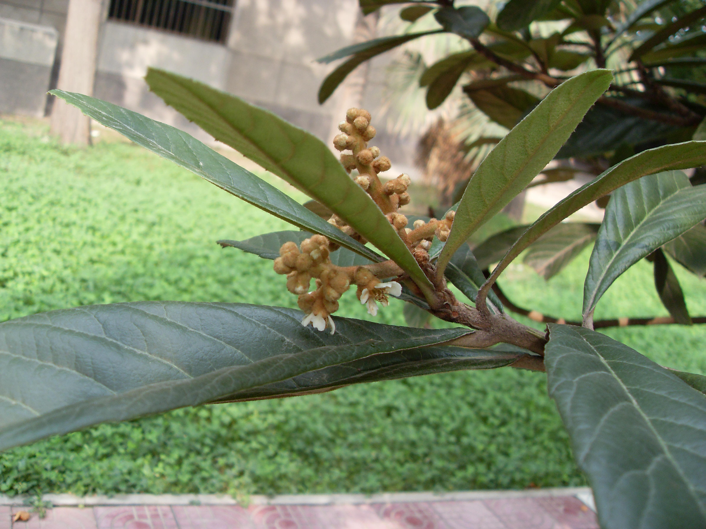
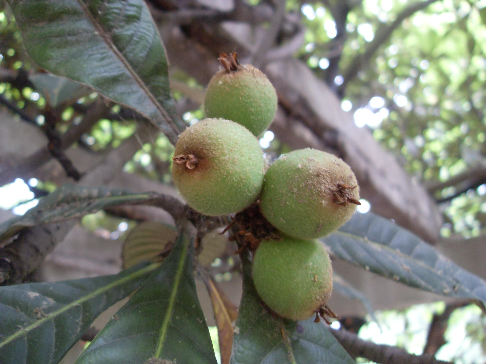

## 枇杷

---

**拉丁名:**  _Eriobotyra japonica(Thunb.) Lindl_

**科 属:** 蔷薇科 枇杷属

**别 名:** 卢橘

**原产地:** 中国

**形  态:** 常绿小乔木，高可达10米。小枝、叶被及花序均密被锈色绒毛。叶粗大革质，常为倒披针状椭圆形，长12～30厘米，先端尖，基部楔形，锯齿粗钝，表面多皱而有光泽。花白色，芳香，10～12月开花，莅年初夏果熟。果近球形或梨形，黄色或橙黄色，直径2～5厘米。　　　　　

**西大分布地:** 北校区见于生命科学学院南侧藤架处及六号教学楼东侧。 

**备注:** 上图为枇杷花枝，2008年9月22日摄于西北大学北校区六号教学楼东侧；左图为枇杷果实，2009年5月13日摄于西北大学北校区生命科学学院南侧。

 

 

