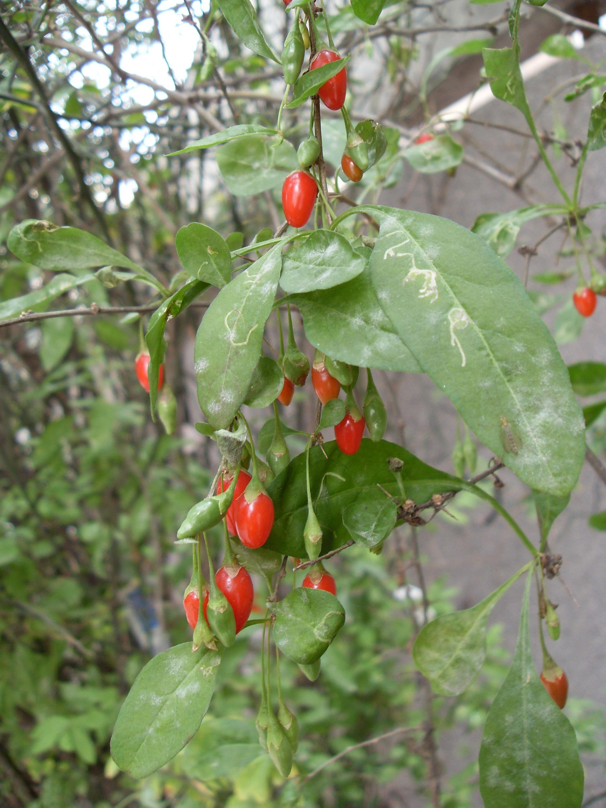
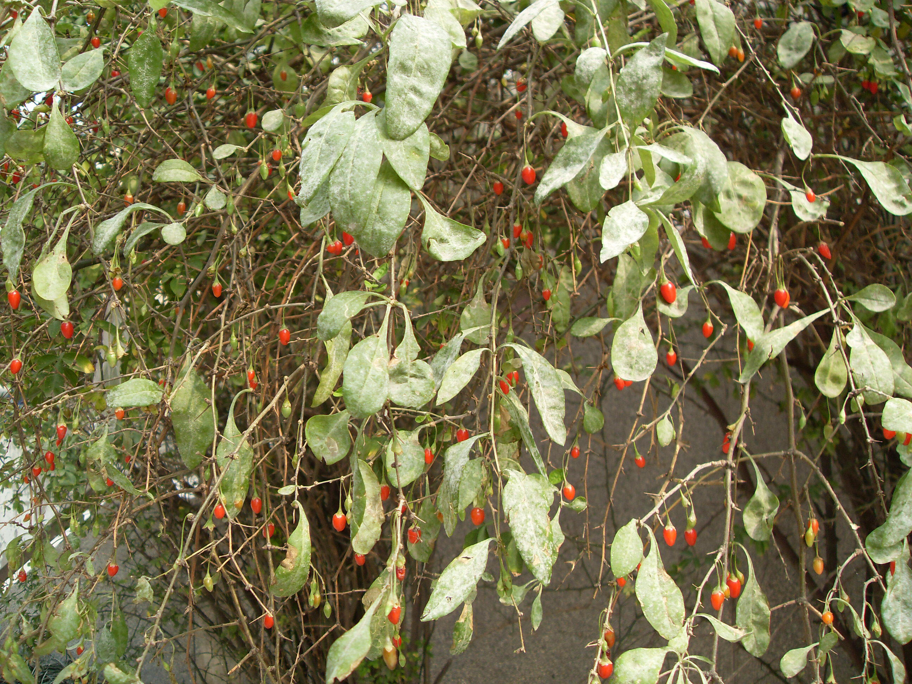

## 枸杞

---

**拉丁名:**  _Lycium chinese Mill_

**科 属:** 茄科 枸杞属

**别 名:** 枸杞菜

**原产地:** 中国

**形  态:** 多分枝状灌木，高1～2米。枝细长，常弯曲下垂，有纵条棱，具针状棘刺。单叶互生或2～4枚簇生，卵形、卵状菱形或卵状披针形，长1.5～5厘米，端急尖，基部楔形。花单生或2～4多簇生叶腋，花冠漏斗形，淡紫色，花冠筒稍短于或近等于花冠裂片。浆果红色卵形，花果期6～11月。

**西大分布地:** 北校区见于8号教学楼西侧阶梯口处和图书馆前花坛。南校区逸生于杂草中。　

**备注:** 2008年10月12日摄于西北大学北校区8号教学楼西侧阶梯口。

 

 

