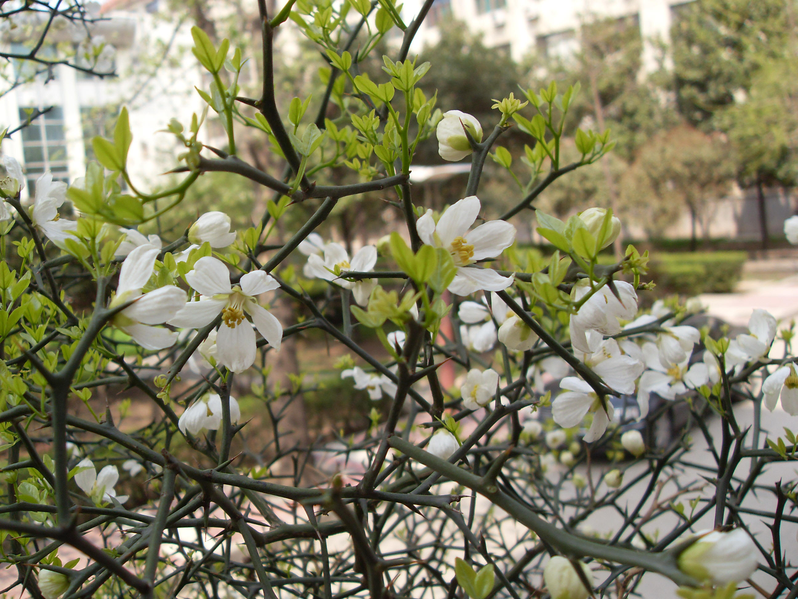

## 枸橘

---

**拉丁名:**  _Poncirus trifoliata(L.) Raf_

**科 属:** 芸香科 枳属

**别 名:** 枳

**原产地:** 中国中部

**形  态:** 灌木或小乔木，高达7米。小枝绿色，偏扁而有棱角，枝刺粗长。小叶3，叶缘有波状浅齿，近革质；顶生小叶大，倒卵形，长2.5～6厘米，叶端钝或微凹，叶基部楔形；侧生小叶较小，基稍歪斜。花白色，径3.5～5厘米。果球形，径3～5厘米，黄绿色，有芳香。花期4月，叶前开放，果期10月。　　

**西大分布地:** 仅见于西北大学北校区八号教学楼西侧楼

**备注:** 上图为枸橘的花，2009年3月25日摄于西北大学北校区八号教学楼西侧楼梯口。左图为枸橘的果实，2008年10月25日摄于西北大学北校区八号教学楼西侧楼梯口

 

