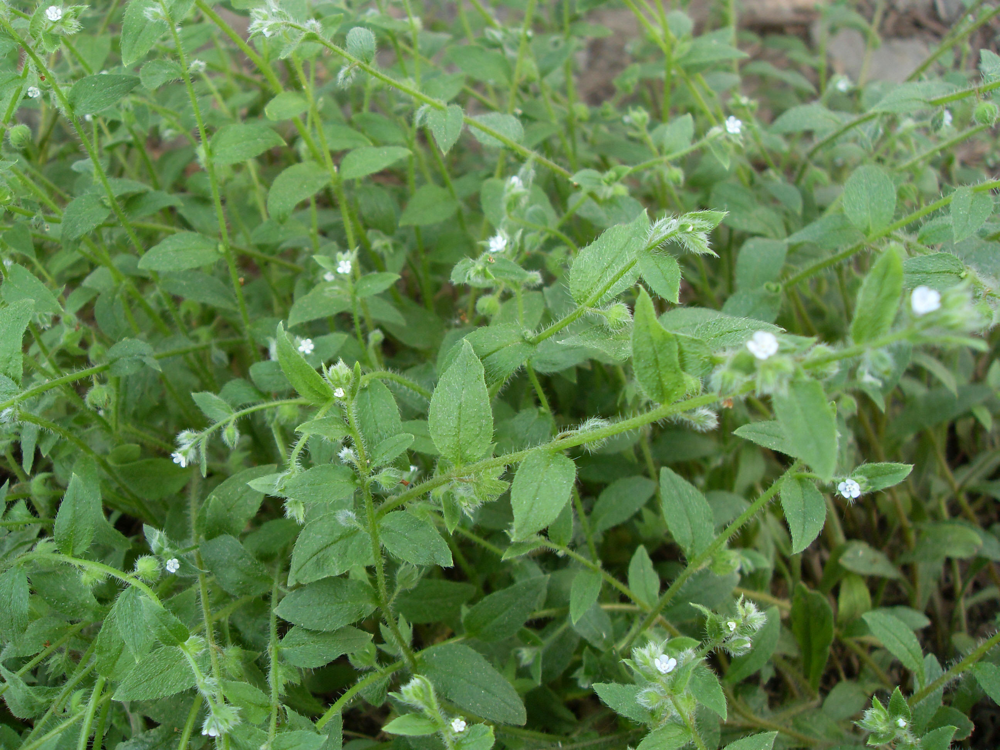

## 柔弱斑种草

---

**拉丁名:**  _Bothriospermum tenellum (Hornem.) Fisch. et Mey _

**科 属:** 紫草科 斑种草属

**别 名:** 细茎斑种草
 【形  态】一年生草本。茎高10～30厘米，直立或渐升，通
  常多分枝，有贴伏的短糙毛。叶狭椭圆形或矩圆形，长1.2～4.8
  厘米，宽0.5～1.5厘米，疏生紧贴的短糙毛。花序狭长，长达12
  厘米；苞片椭圆形或狭卵形；花萼长约1.5毫米，有糙伏毛，5
  裂近基部；花冠淡蓝色，直径约2毫米，喉部有5个附属物；小
  坚果4,肾形，长约1.2毫米，密生小疣状突起，内面有纵椭圆状
  凹陷。
 【西大分布地】常见杂草，见于南北校区各处。
备注:
    2009年4月13日摄于西北大学北校区西大医院前花坛内。
  　

**原产地:** 柔弱斑种草
详细资料： 首页 下一页 上一页
【拉丁名】Bothriospermum tenellum (Hornem.) Fisch. et Mey.
【科 属】紫草科 斑种草属
【别 名】细茎斑种草
【形 态】一年生草本。茎高10～30厘米，直立或渐升，通
 常多分枝，有贴伏的短糙毛。叶狭椭圆形或矩圆形，长1.2～4.8
 厘米，宽0.5～1.5厘米，疏生紧贴的短糙毛。花序狭长，长达12
 厘米；苞片椭圆形或狭卵形；花萼长约1.5毫米，有糙伏毛，5
 裂近基部；花冠淡蓝色，直径约2毫米，喉部有5个附属物；小
 坚果4,肾形，长约1.2毫米，密生小疣状突起，内面有纵椭圆状
 凹陷。
【西大分布地】常见杂草，见于南北校区各处。
备注:
 2009年4月13日摄于西北大学北校区西大医院前花坛内。
 　

**形  态:** 一年生草本。茎高10～30厘米，直立或渐升，通常多分枝，有贴伏的短糙毛。叶狭椭圆形或矩圆形，长1.2～4.8厘米，宽0.5～1.5厘米，疏生紧贴的短糙毛。花序狭长，长达12厘米；苞片椭圆形或狭卵形；花萼长约1.5毫米，有糙伏毛，5裂近基部；花冠淡蓝色，直径约2毫米，喉部有5个附属物；小坚果4,肾形，长约1.2毫米，密生小疣状突起，内面有纵椭圆状凹陷。

**西大分布地:** 常见杂草，见于南北校区各处。

**备注:** 柔弱斑种草详细资料：首页下一页上一页【拉丁名】Bothriospermumtenellum(Hornem.)Fisch.etMey.【科属】紫草科斑种草属【别名】细茎斑种草【形态】一年生草本。茎高10～30厘米，直立或渐升，通常多分枝，有贴伏的短糙毛。叶狭椭圆形或矩圆形，长1.2～4.8厘米，宽0.5～1.5厘米，疏生紧贴的短糙毛。花序狭长，长达12厘米；苞片椭圆形或狭卵形；花萼长约1.5毫米，有糙伏毛，5裂近基部；花冠淡蓝色，直径约2毫米，喉部有5个附属物；小坚果4,肾形，长约1.2毫米，密生小疣状突起，内面有纵椭圆状凹陷。【西大分布地】常见杂草，见于南北校区各处。备注:2009年4月13日摄于西北大学北校区西大医院前花坛内。　

.JPG) 

 

