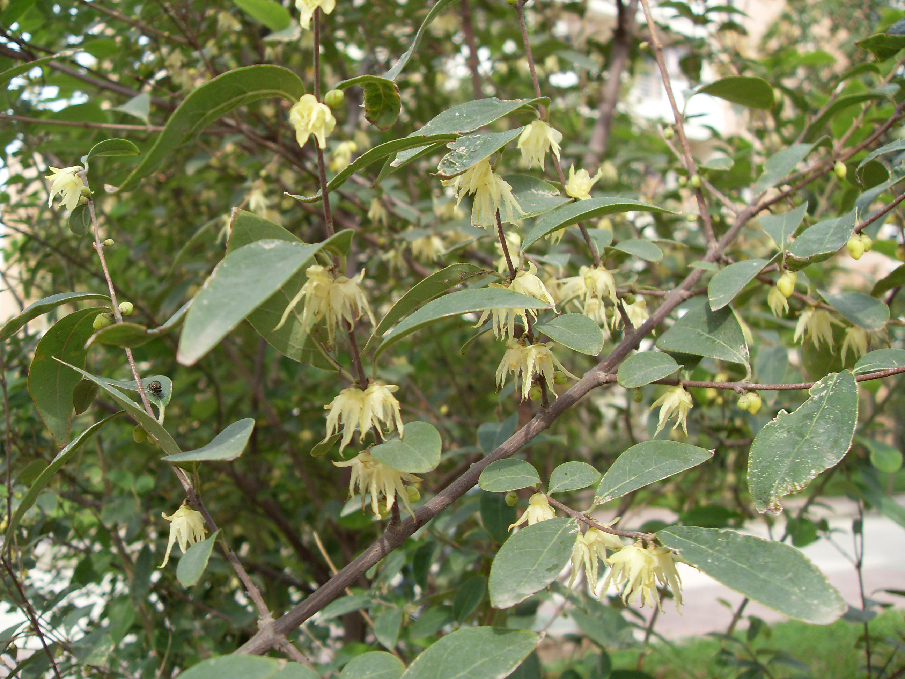

## 柳叶腊梅

---

**拉丁名:**  _Chimonanthus salicifolius Hu_

**科 属:** 腊梅科 腊梅属

**别 名:** Chimonanthus salicifolius Hu
【科  属】腊梅科   腊梅属

**原产地:** 中国江西

**形  态:** 灌木，幼枝条四方形，老枝近圆柱形，被微毛。叶近革质，线状披针形或长圆状披针形，长2.5～13厘米，宽l一2．5厘米，两端钝至渐尖，叶面粗糙，无毛，叶背浅绿色，被不明显的短柔毛。花单朵腋生，小，有短梗，花黄色或黄白色。果托坛状，长2～5厘米，口部收缩，成熟时灰褐色。花期8—10月。

**西大分布地:** 仅见于南校区　

**备注:** 2008年10月18日摄于西北大学南校区　

 

