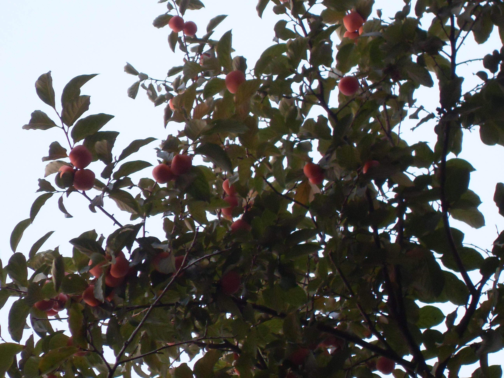

## 柿树

---

**拉丁名:**  _Diospyros kaki thund_

**科 属:** 柿树科 柿树属

**别 名:** 朱果，猴枣

**原产地:** 中国

**形  态:** 落叶乔木，高达15米。树皮暗黑色，呈长方形小裂纹。小枝密生褐色或棕色柔毛，后渐脱落。叶椭圆形、阔椭圆形或倒卵形，长6～18厘米，近革质，叶端渐尖，基部阔楔形或近圆形。雌雄异株或同株，花4基数，花冠钟状，黄白色，4裂，有毛。雄花3朵排成小聚伞花序，雌花单生叶腋，花期5～6月。浆果卵圆形或扁球形，直径2.5～8厘米，橙黄色或鲜黄色，宿存萼卵圆形先端钝圆，果期9～10月。　　

**西大分布地:** 北校区多分布于西大花房内及化学系南侧。 

**备注:** 上图为柿树果实，2008年10月12日摄于西北大学北校区西大花房内。左图为柿树花枝，2009年4月30日摄于西北大学北校区化学系南侧。

 

 

