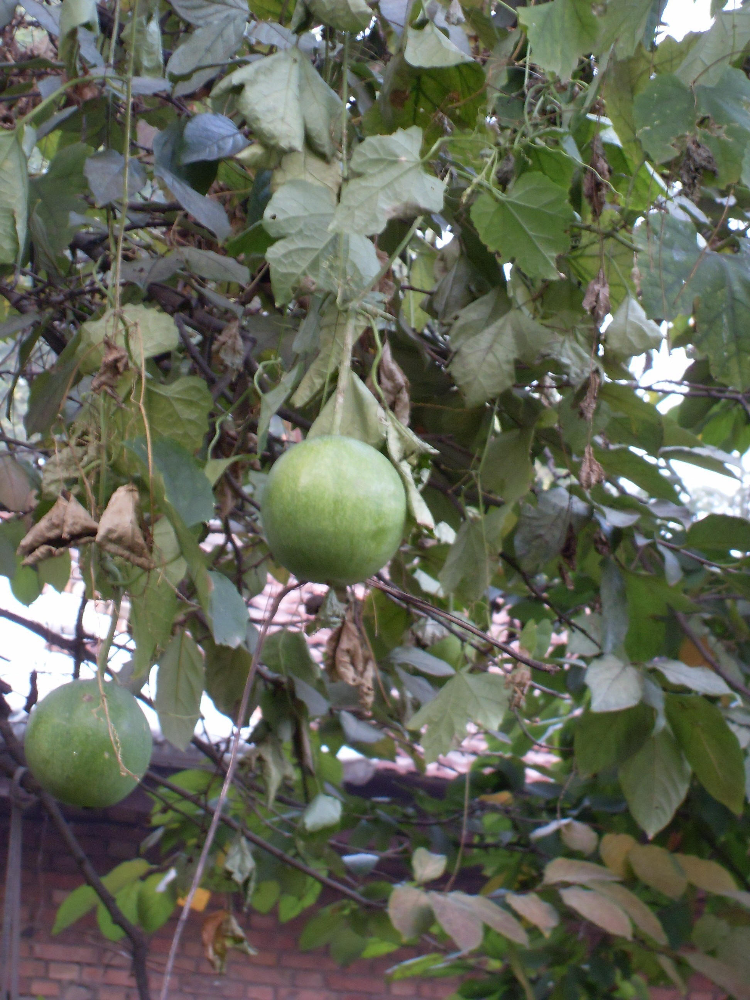
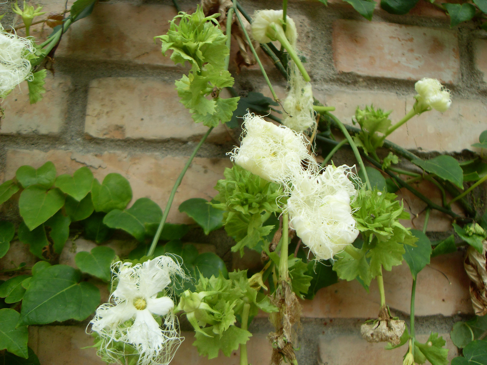

## 栝楼

---

**拉丁名:**  _Trichosanthes kirilowii Maxim _

**科 属:** 葫芦科 栝楼属

**别 名:** 药瓜、野苦瓜
 【原产地】中国
 【形  态】多年生草质藤本。块根肥大，圆柱形。茎
  多分枝，卷须细长。单叶互生，具长柄。雌雄异株，
  花白色，雄花成总状花序；雌花单生于叶腋，果实近
  球形，成熟时金黄色。种子多数，扁长椭圆形。花期
  7～8月，果熟期9～10月。
  
 
　
　
　
                                                                       【西大分布地】见于北校区西大花园内。
                                                                        备注：
                                                                            上图为栝楼花枝，2009年7月28日摄于西北大学北校区西大花园内；
                                                                            左图为栝楼果实，2008年10月12日摄于西北大学北校区西大花园内。

**原产地:** 中国
【形 态】多年生草质藤本。块根肥大，圆柱形。茎
 多分枝，卷须细长。单叶互生，具长柄。雌雄异株，
 花白色，雄花成总状花序；雌花单生于叶腋，果实近
 球形，成熟时金黄色。种子多数，扁长椭圆形。花期
 7～8月，果熟期9～10月。
 

　
　
　
 【西大分布地】见于北校区西大花园内。
 备注：
 上图为栝楼花枝，2009年7月28日摄于西北大学北校区西大花园内；
 左图为栝楼果实，2008年10月12日摄于西北大学北校区西大花园内。

**形  态:** 多年生草质藤本。块根肥大，圆柱形。茎多分枝，卷须细长。单叶互生，具长柄。雌雄异株，花白色，雄花成总状花序；雌花单生于叶腋，果实近球形，成熟时金黄色。种子多数，扁长椭圆形。花期7～8月，果熟期9～10月。　　　

**西大分布地:** 见于北校区西大花园内。 

**备注:** 上图为栝楼花枝，2009年7月28日摄于西北大学北校区西大花园内；左图为栝楼果实，2008年10月12日摄于西北大学北校区西大花园内。

 

 

