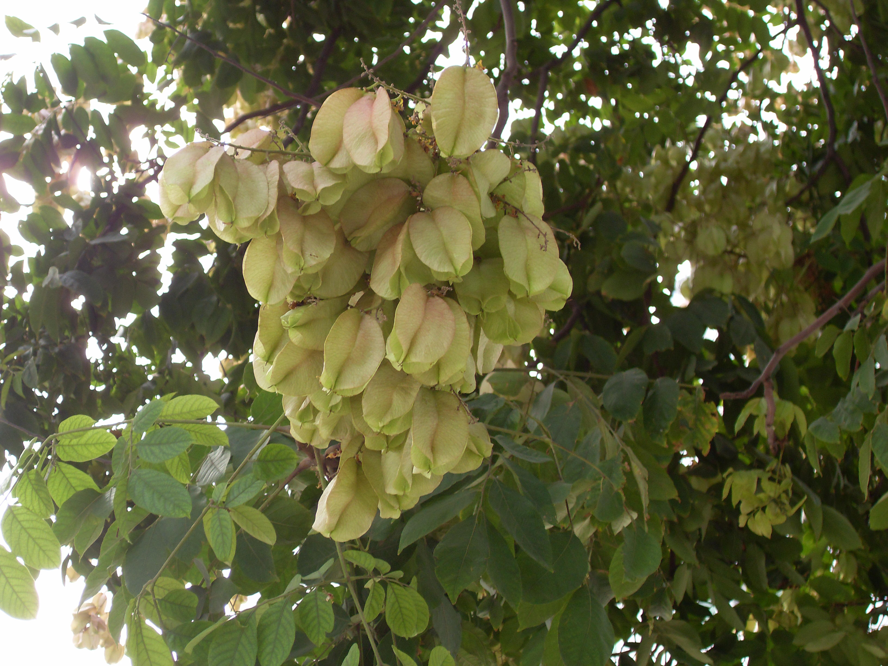

## 栾树

---

**拉丁名:**  _Koelreuteria paniculata Laxm_

**科 属:** 无患子科 栾树属

**别 名:** 摇钱树、灯笼花

**原产地:** 中国北部及中部

**形  态:** 落叶乔木，高达15米；树冠近圆球形。树皮灰褐色，细纵裂；小枝稍有棱，无顶芽，皮孔明显。奇数羽状复叶，有时部分小叶深裂而为不完全的2回羽状复叶，长达40厘米；小叶7～15，卵形或卵状椭圆形，缘有不规则粗齿。花小，金黄色；顶生圆锥花序宽而疏散。蒴果囊状，长4～5厘米，先端狭窄而成短尖，果皮膜质，常带红色，成熟胞被开裂有3果瓣，每室有1种子。种子黑色，圆球形。花期6～7月，果期9～10月。

**西大分布地:** 三校区常见的行道树。北校区见于西边食堂拐角及西大医院北侧行道处；南校区见于学府大道两侧及校内行道；桃园校区见于教工家属区东门附近。

**备注:** 2008年9月22日摄于西北大学北校区西大医院北侧行道旁。

 

