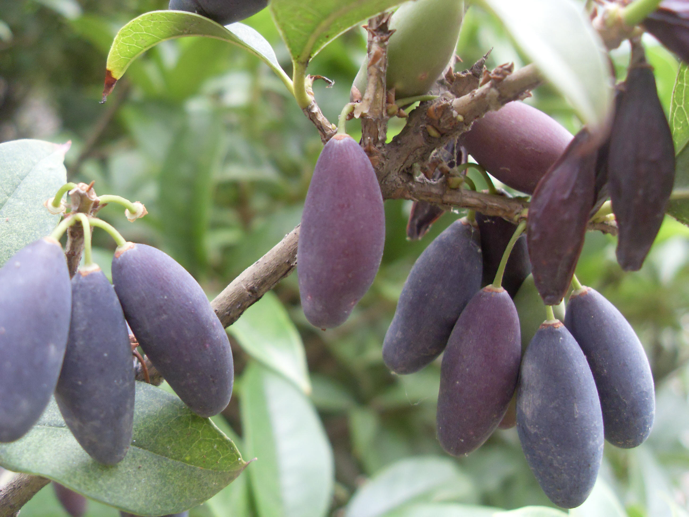

## 桂花

---

**拉丁名:**  _Osmanthus fragrans(thunb.)Lour_

**科 属:** 木樨科 木樨属

**别 名:** 木樨，岩桂

**原产地:** 中国西南部

**形  态:** 常绿灌木至小乔木，高达12米。树皮灰色，不裂。芽叠生。叶长椭圆形，长5～12厘米，革质，先端尖，基部楔形，全缘或上半部有细锯齿。花簇生叶腋或聚伞状，花小，4裂，花黄白色、黄色或橙色，浓香，花期9～10月。核果椭球形，紫黑色。

**西大分布地:** 桂花多分布于北校区，见于科学楼南面行道两侧、行政楼南侧、图书馆南侧、宝际寺遗址纪念亭北侧。西大现有银桂、丹桂两个变种。　　　　　　　　　　　

**备注:** 上图为丹桂，下图右为银桂。2008年9月17日摄于科学楼南面行道两侧；下图左为桂花果实，2009年5月13日摄于科学楼南面行道两侧。　

 

