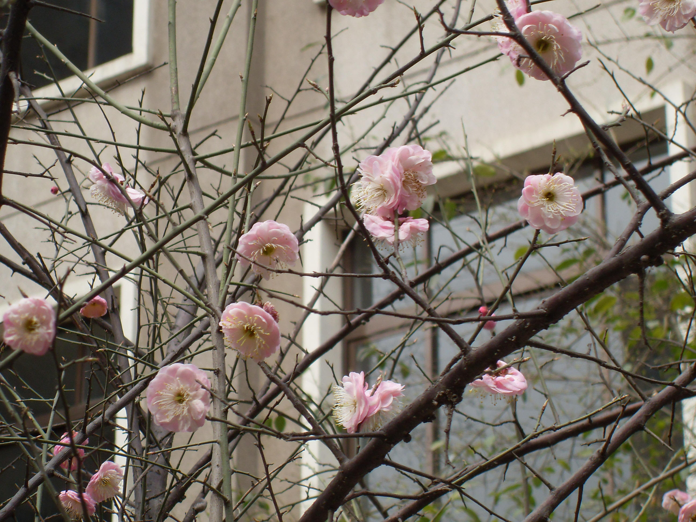
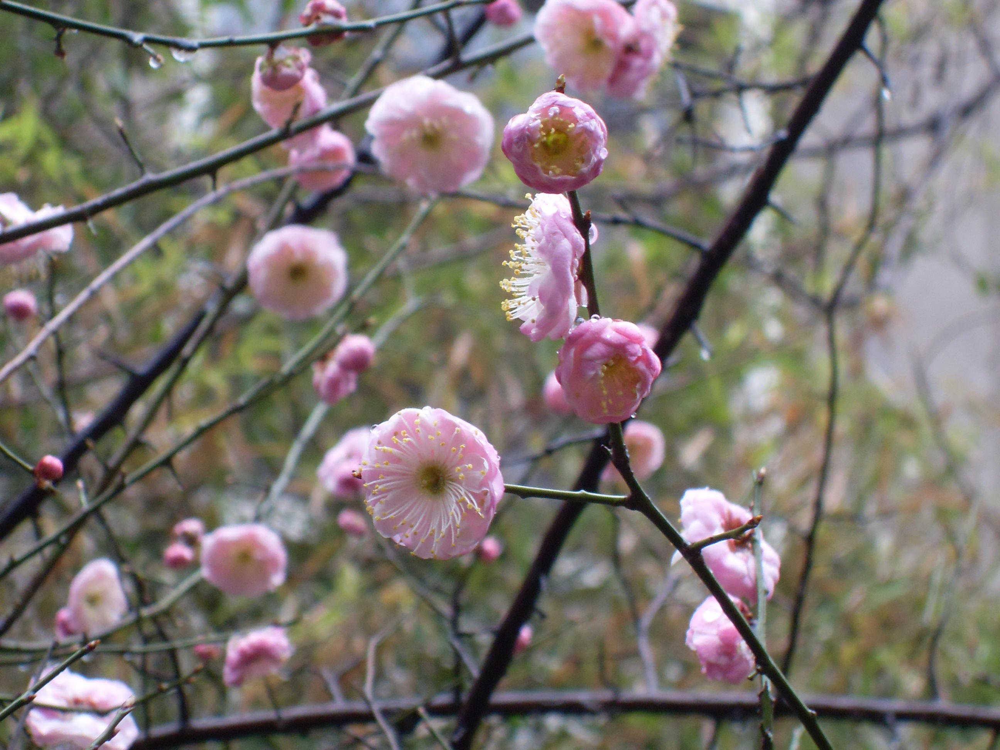

## 梅花

---

**拉丁名:**  _Prunus mume sieb.et Zuee_

**科 属:** 蔷薇科 李属

**别 名:** 干枝梅

**原产地:** 中国西南

**形  态:** 落叶乔木，高达10米。枝干紫褐色，有纵驳纹；小枝细而无毛，多为绿色。叶广卵形至卵形，长4～10厘米，先端渐长尖或尾尖，基部广楔形或近圆形，锯齿细长。花1～2朵聚生，具短梗，淡粉色或白色，有芳香，冬季或早春叶前开放。果球形，绿黄色，密被细毛，果期5～6月。

**西大分布地:** 仅见于北校区六号教学楼后及生命科学学院南。　

**备注:** 2009年2月25日摄于西北大学北校区六号教学楼后。

 

 

