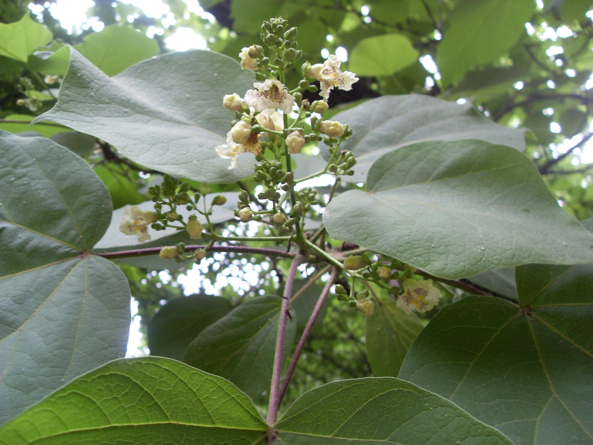
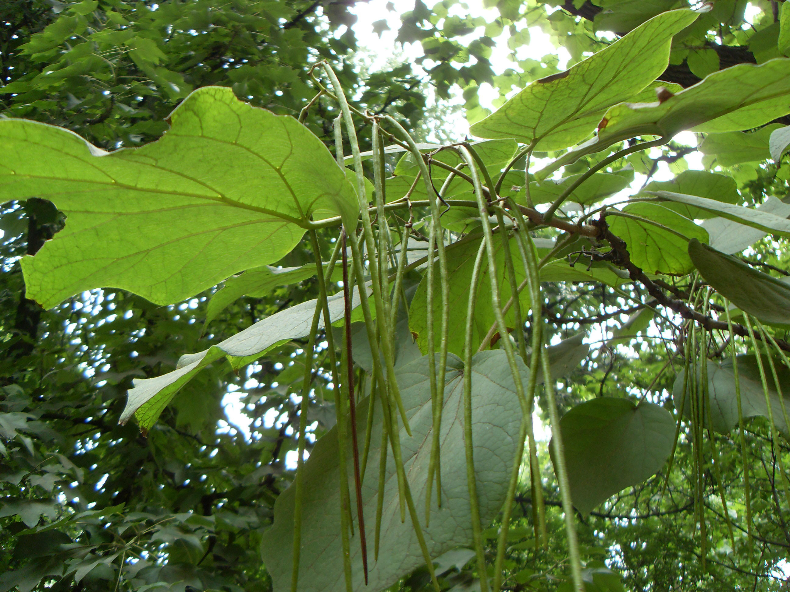

## 梓树

---

**拉丁名:**  _Catalpa ovata G. Don _

**科 属:** 紫葳科 梓属

**别 名:** 楸豇豆树、木角豆

**原产地:** 中国

**形  态:** 落叶乔木，高10～20米；树冠开展，树皮灰褐色，纵裂。叶广卵形或近圆形，长10～30厘米，通常3～5浅裂，有毛，背面基部脉腋有紫斑。圆锥花序顶生，长10～20厘米；花萼绿色或紫色；花冠淡黄色，长约2厘米，内面有黄色条纹及紫色斑纹。蒴果细长如筷，长20～30厘米。种子具毛，花期5月，果期8～9月。　　　　

**西大分布地:** 见于北校区地质系前东侧及大学南路两侧。

**备注:** 上图为梓树花枝，2009年5月13日摄于西北大学北校区地质系楼前东侧；左图为梓树果实，2009年7月28日摄于西北大学北校区地质系楼前东侧

 

 

