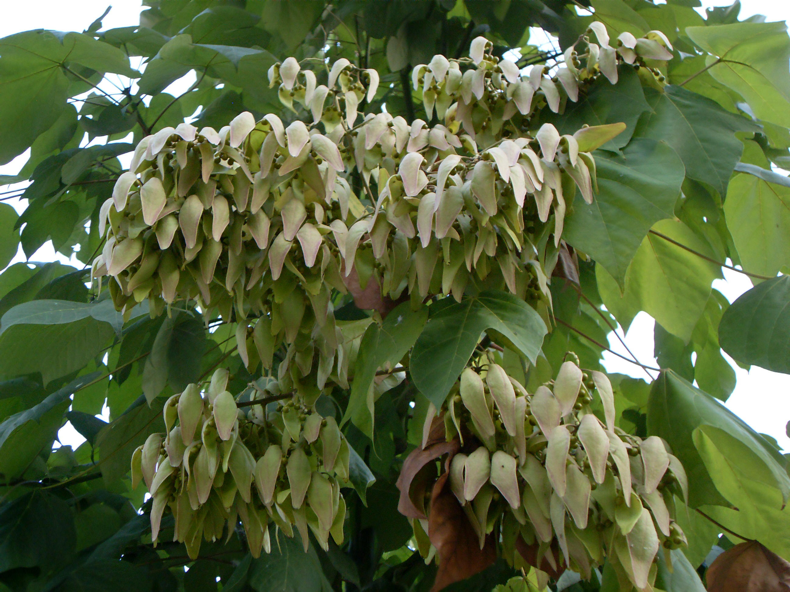

## 梧桐

---

**拉丁名:**  _Firmiana platanifolia (Linn. f.) Marsili _

**科 属:** 梧桐科 梧桐属

**别 名:** 青桐、桐麻

**原产地:** 中国 

**形  态:** 梧桐科梧桐属落叶大乔木，高达15米；树干挺直，树皮绿色，平滑。叶心形，3～5掌状分裂，通常直径15～30厘米，裂片三角形，顶端渐尖，全缘，5出脉，背面有细绒毛；叶柄长8—30厘米。花小，黄绿色；萼片5深裂，裂片被针形，向外反卷曲，外面密生黄色星状毛；花瓣缺；子房球形，5室，基部有退化雄蕊。蓇葖4—5，纸质，叶状，长6～10厘米，宽1.3～2.4厘米，有毛；种子形如豌豆，2～4颗着生果瓣边缘，成熟时棕色，有皱纹。花期7月，果熟期11月。

**西大分布地:** 多见于南校区学生宿舍区。

**备注:** 上图为梧桐花枝，2009年6月17日摄于西北大学南校区学生宿舍区；左图为梧桐果实，2009年7月27日摄于西北大学南校区学生宿舍区。　

.JPG) 

 

