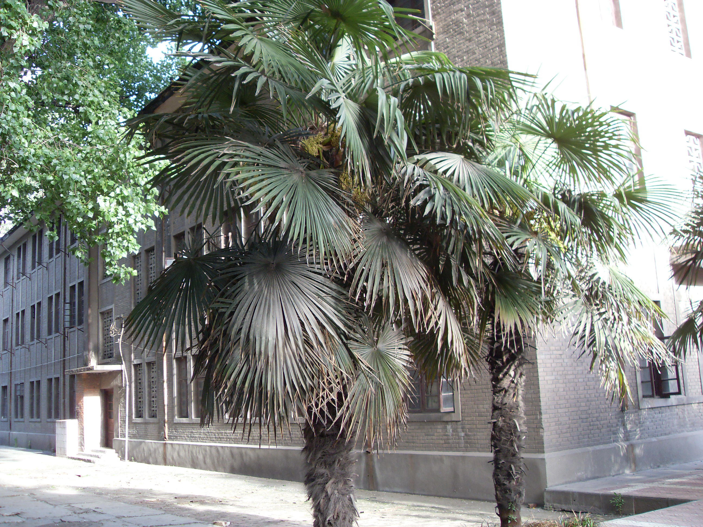
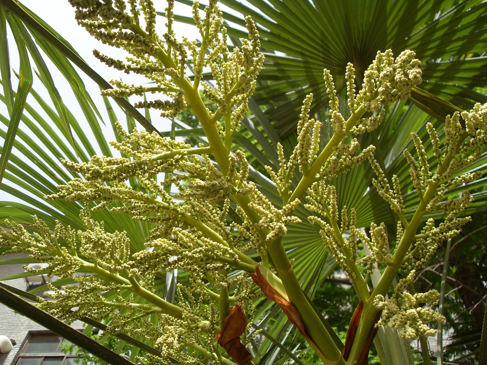
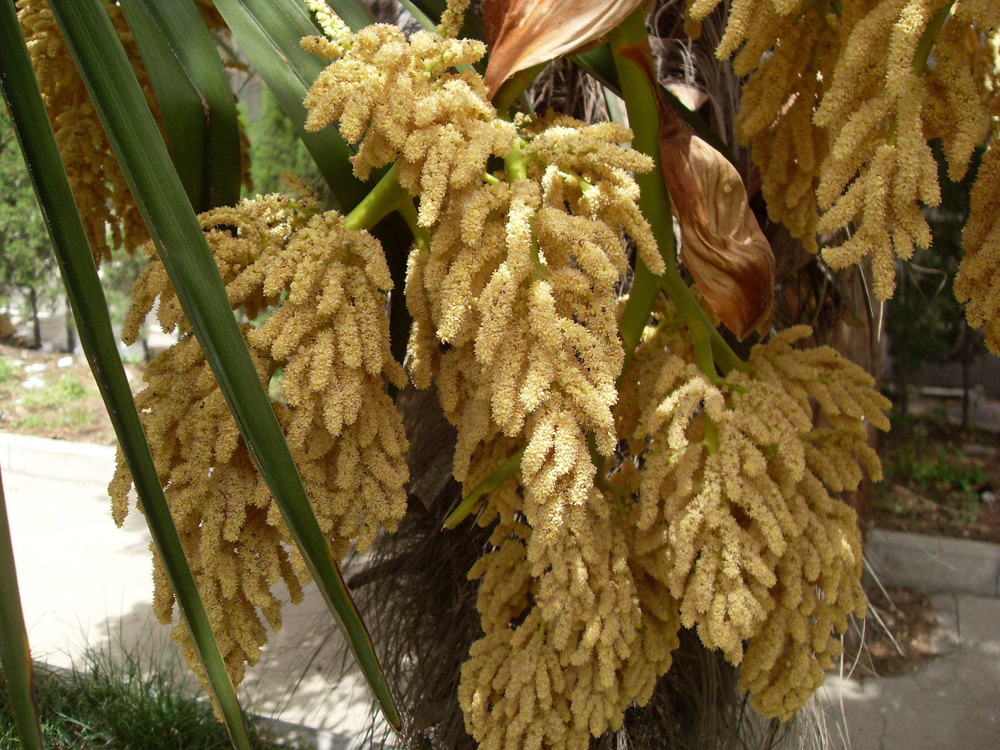

## 棕榈

---

**拉丁名:**  _Trachycapus fortunei(Hook.)H.Wendl_

**科 属:** 棕榈科 棕榈属

**别 名:** 棕树、唐棕

**原产地:** 中国

**形  态:** 常绿乔木，高6～8米。茎直立，外被纤维状的叶鞘包围，叶多簇生于茎顶，圆形或近于圆形，掌状裂，裂至中部或中部以下；叶柄较粗短，两旁有硬齿。雌雄异株，花黄色，华北6枚，卵形。核果球形，直径约1厘米，蓝褐色。花果期5～10月。　　　　　　　　　　　　　

**西大分布地:** 三校区常见绿化树种，多配置于建筑物前。

**备注:** 右上图为棕榈单株树形，2009年4月20日摄于西北大学北校区宿舍楼后；右下图为棕榈雌花，2009年4月20日摄于西北大学北校区生科院楼后；左图为棕榈雄花，2009年4月20日摄于西北大学北校区生科院楼后。　　

 

 

 

