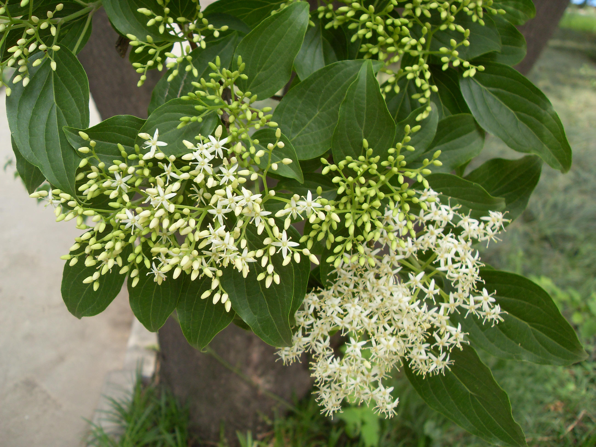
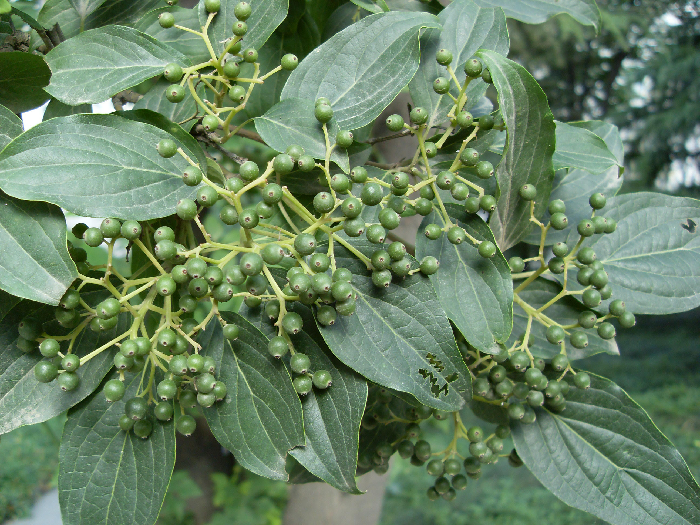

## 棶木

---

**拉丁名:**  _Swida macrophylla (Wall.) Sojak _

**科 属:** 山茱萸科 棶木属

**别 名:** 凉子木

**原产地:** 中国

**形  态:** 落叶乔木或灌木，高4～15米。一年生枝赤褐色。叶对生椭圆状卵形至椭圆状矩圆形，先端渐尖，基部圆形或阔楔形，长稍偏斜，边缘具不整齐的波状缘。二期聚伞花序圆锥形，顶生；花小，白色至黄色。核果球形，蓝黑色。种子球形，黑色。花期5月，果期10月。　　　　　　

**西大分布地:** 仅见于北校区生命科学学院楼后。 

**备注:** 上图为棶木花枝，2009年4月27日摄于西北大学北校区生命科学学院楼后；左图为棶木果实，2009年7月5日摄于西北大学北校区生命科学学院楼后。

 

 

