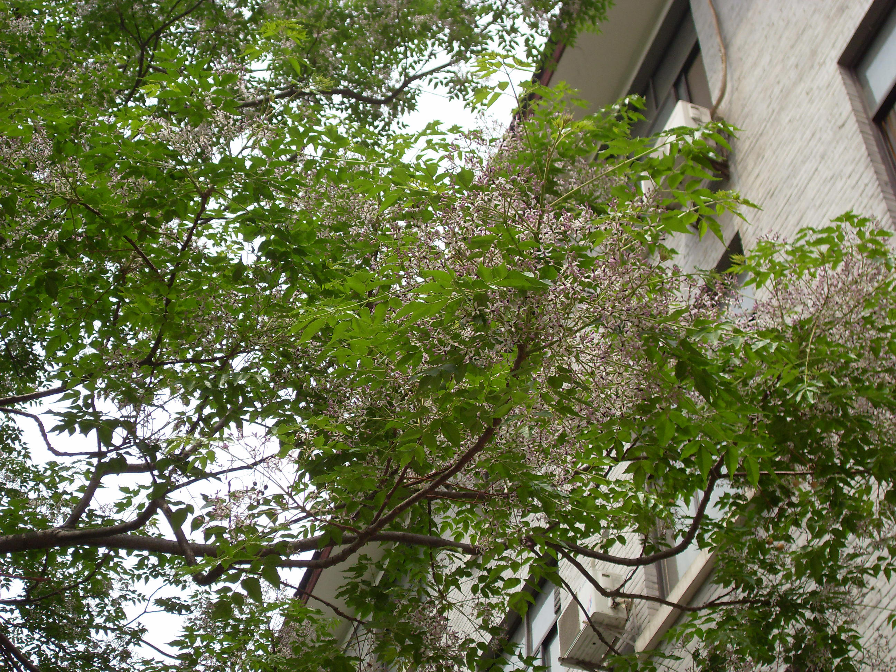

## 楝树

---

**拉丁名:**  _Melia azedarach Linn_

**科 属:** 楝科 楝属

**别 名:** 苦楝

**原产地:** 中国华北至华南

**形  态:** 落叶乔木，高达15～20米。枝条广展，树冠近于平顶。树皮暗褐色，浅纵裂。小枝粗壮，皮孔多而明显，幼枝有星状毛。2～3回奇数羽状复叶，小叶卵形至卵状长椭圆形，长3～8厘米，先端渐尖，基部楔形或圆形，缘有锯齿或裂。花淡紫色，长约1厘米，有香味；呈圆锥状复聚伞花序，长25～30厘米。核果近球形，径1～1.5厘米，熟时黄色，宿存树枝，经冬不落。花期4～5月；果期10～11月成熟。

**西大分布地:** 北校区分布于生命科学学院前；南校区分布于中央广场周围。

**备注:** 2009年4月27日摄于西北大学北校区生命科学学院前。

 

