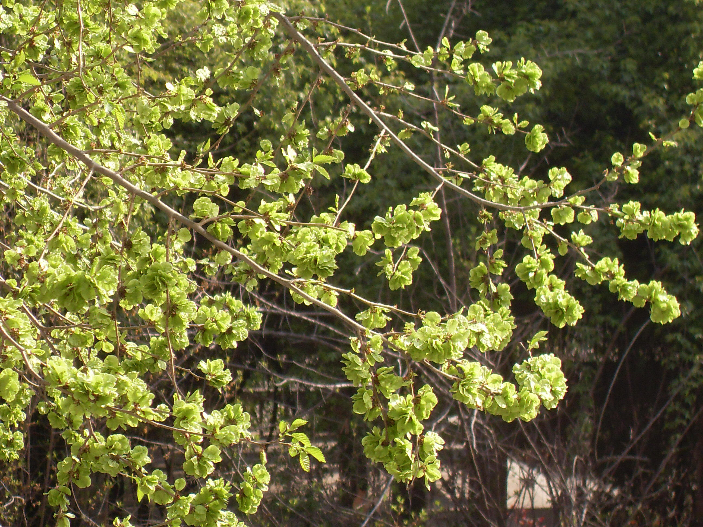

## 榆树

---

**拉丁名:**  _Ulmus pumila L_

**科 属:** 榆科 榆属

**别 名:** 白榆、家榆

**原产地:** 中国及东北亚国家

**形  态:** 落叶乔木，高达25米，胸径1米，树冠圆球形。树皮暗灰色，纵裂，粗糙。小枝灰色，细长，排成二列状。叶卵状长椭圆形，长2～6厘米，先端尖基部稍歪，缘有不规则的单锯齿。早春叶前开花，簇生于去年生的枝上。翅果近圆形，种子位于翅果中部。花期3～4月，果期4～6月。

**西大分布地:** 仅见于北校区生命科学学院南侧门口。

**备注:** 2009年3月23日摄于西北大学北校区生命科学学院南侧门口。

 

