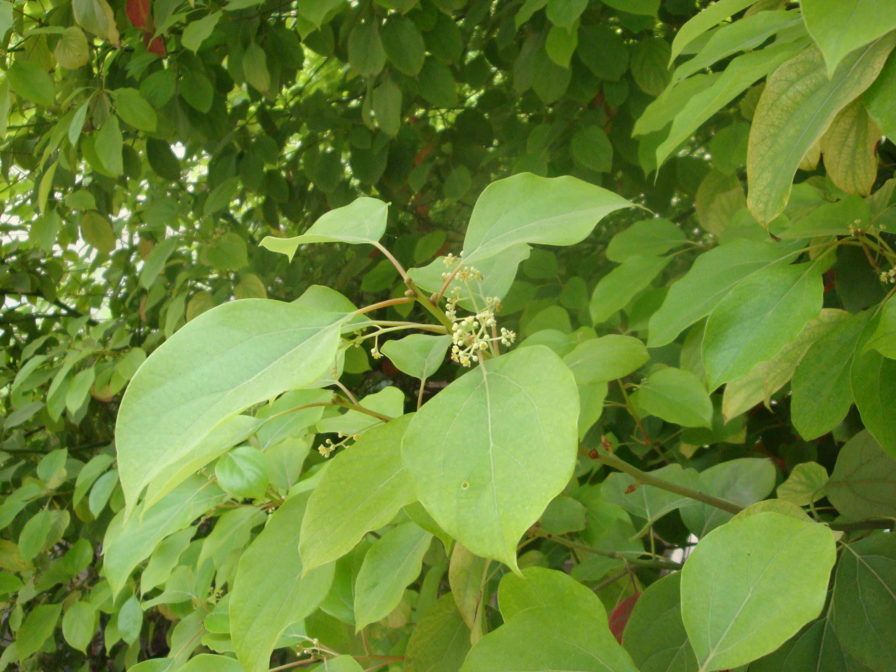

## 樟树

---

**拉丁名:**  _Cinnamomum camphora (Linn.) Presl _

**科 属:** 樟科 樟属

**别 名:** 香樟

**原产地:** 东亚

**形  态:** 常绿乔木，一般高20～30米，胸径4～5米，树冠广圆形。树皮灰褐色，纵裂。叶互生，卵状椭圆形，长5～8厘米，薄革质离基3出脉，脉腋有腺体，全缘，两面无毛，背面灰绿色。圆锥花序腋生于新枝，花被淡黄绿色，6裂，有芳香。核果球形径约6毫米，熟时紫黑色，果托盘状。花期5月，果期9～11月。

**西大分布地:** 仅于北校区西大花园内栽有两株。

**备注:** 2009年5月4日摄于西北大学北校区西大花园内。

 

