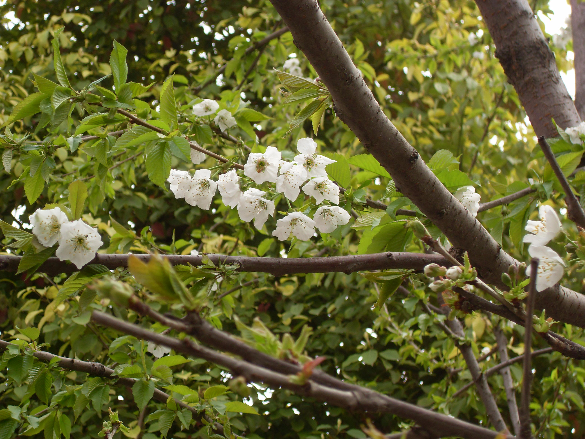
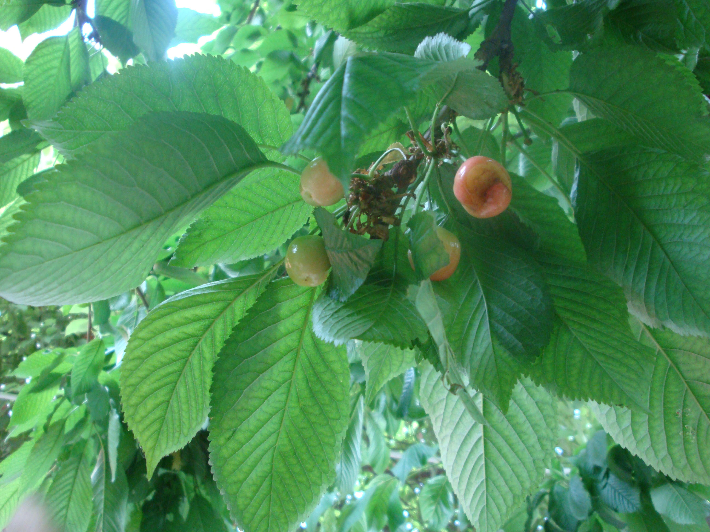

## 樱桃

---

**拉丁名:**  _Cerasus pseudocerasus (Lindl) G.Don_

**科 属:** 蔷薇科 樱属

**别 名:** 莺桃、樱珠

**原产地:** 中国

**形  态:** 落叶乔木，高6～8米。叶卵状或椭圆形卵状，边缘有大小不等的重锯齿，齿间有腺，下面有稀疏柔毛。伞状花序或有总梗的总状花序，花瓣先端凹，近圆形，白色。核果近球形，红色。花期3～4月，果期5～6月。　　　　　

**西大分布地:** 仅见于北校区西大花园内

**备注:** 上图为樱桃花枝，2009年3月28日摄于西北大学北校区西大花园内；左图为樱桃果枝，2009年5月4日摄于西北大学北校区西大花园内。

 

 

