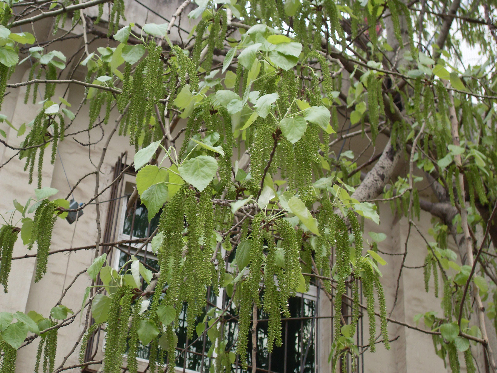

## 毛白杨

---

**拉丁名:**  _Populus tomentosa Carr_

**科 属:** 杨柳科 杨属

**别 名:** 白杨、大叶杨

**原产地:** 中国

**形  态:** 落叶乔木，高达30～40厘米，胸径1.5～2米；树冠卵圆形或卵形。树皮幼时青白色，皮孔菱形；老时树皮纵裂，呈暗灰色。幼枝灰绿色，密被灰白色绒毛。长枝之叶三角状卵形，先端渐尖，基部心形或截形，缘具缺刻或锯齿，表边光滑或稍有毛，背面密被白绒毛，后渐脱落。短枝之叶三角状卵圆形，缘具波状缺刻，幼时有毛，后脱落。雌株大枝较为平展，花芽小而稀疏；雄株大枝多斜生，花芽大而密集。花期3～4月，叶前开放。蒴果小，三角形，4月下旬成熟。

**西大分布地:** 见于北校区操场周围和学生宿舍外行道。

**备注:** 2009年4月2日摄于西北大学北校区操场。

 

