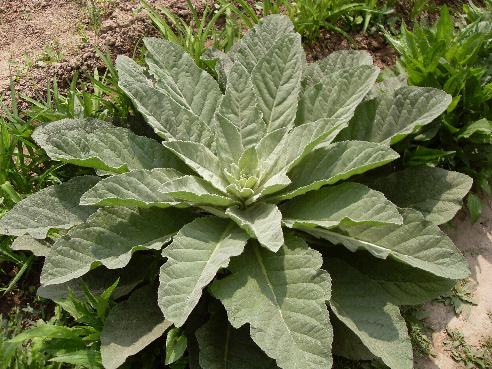

## 毛蕊花

---

**拉丁名:**  _Verbascum thapsus Linn_

**科 属:** 玄参科 毛蕊花属

**别 名:** 一柱香、大毛叶

**原产地:** 原产中国新疆，南欧、俄罗斯西伯利亚

**形  态:** 二年生草本，茎直立，高1-1.7米。全株密被黄色绒毛与星状毛。基生叶，倒披针状长圆形，长达10-25厘米，宽5-8厘米；茎生叶渐缩小呈长圆形，基部下延成狭翅。穗状花序顶生，花冠黄色，花径1-2厘米。蒴果卵圆形，种子多数，细小，粗糙。花期6月，果期9月。　　　　　　

**西大分布地:** 仅见于北校区西大花园内。 

**备注:** 上图为毛蕊花莲座状株形，2009年4月17日摄于西北大学北校区西大花园内；左图为毛蕊花花枝，2009年5月20日摄于西北大学北校区西大花园内。　

.JPG) 

 

