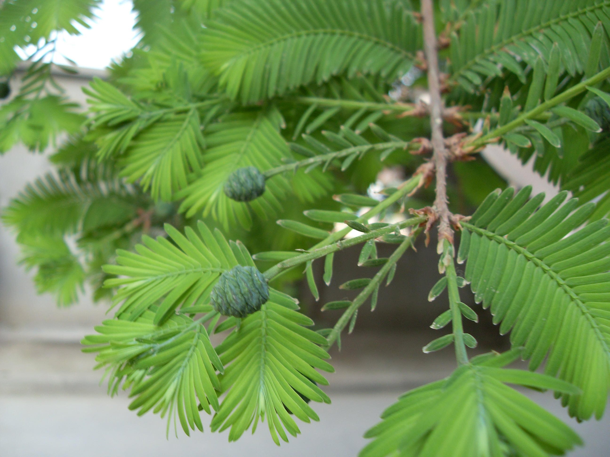

## 水杉

---

**拉丁名:**  _Metasequoia glyptostroboidea Hu et Cheng_

**科 属:** 杉科 水杉属

**别 名:** 东方红杉

**原产地:** 中国（国家一级保护植物）

**形  态:** 落叶乔木，高达35～41.5米，胸径达1.6～2.4米；树皮灰褐色或深灰色，裂成条片状脱落；叶交互对生，在绿色脱落的侧生小枝上排成羽状二列，线形，柔软，几乎无柄。雌雄同株，雄球花单生叶腋或苞腋，卵圆形，交互对生排成总状或圆锥花序状。雌球花单生侧枝顶端，由22－28枚交互对生的苞鳞和珠鳞所组成。球果下垂，当年成熟，果蓝色，近球形或长圆状球形，微具四棱。种子倒卵形，扁平，周围有窄翅，先端有凹缺。

**西大分布地:** 北校区见于六、七号教学楼周围及生命科学学院东侧、北侧。南校区较少仅见于教学五、六号楼附近。

**备注:** 2009年4月13日摄于西北大学北校区生命科学学院东侧。

 

 

