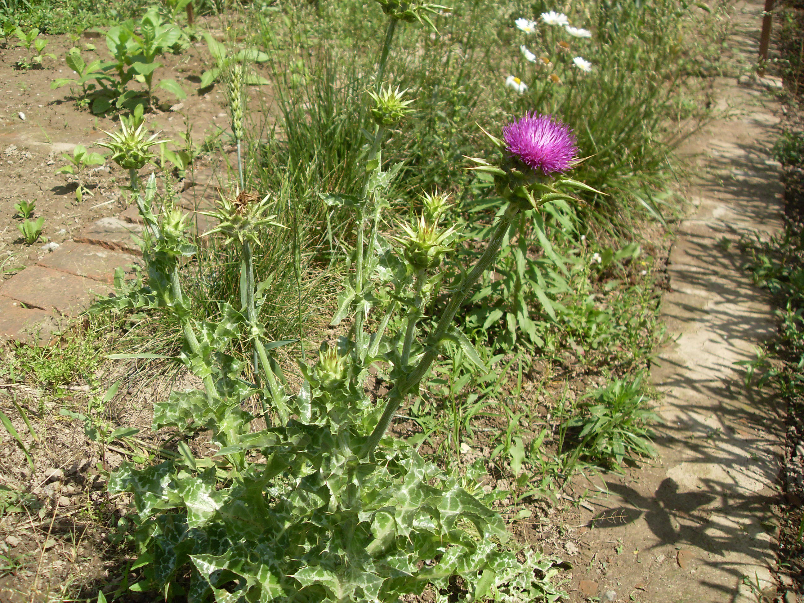

## 水飞蓟

---

**拉丁名:**  _Silybum marianum (Linn.) Gaertn_

**科 属:** 菊科 菜蓟族 水飞蓟属

**别 名:** 乳蓟、水飞雉

**原产地:** 地中海沿岸

**形  态:** 一二年生草本。茎直立，高30～200厘米，多分枝，光滑或被蛛丝状毛，有纵棱槽。叶互生，基部叶常平铺地面，成莲座状，长椭圆状披针形，深或浅羽状分裂，缘齿有尖刺，长40～80厘米，宽10～30厘米，表面亮绿色，有乳白色斑纹，基部抱茎；中部、上部叶片渐小，上部叶披针形。头状花序直径3～6厘米，单生枝顶，总苞宽球形，总苞片革质，顶端有长刺；管状花紫红色、淡红色或少有白色。瘦果长椭圆形，暗褐色或黑色。有纵条纹及白色斑纹；冠毛多数，白色，不等长，基部合生成环。花期5～6月，果期6～7月。

**西大分布地:** 偶见于南北校区，2008年见于模拟法庭东侧荒坡， 本株2009年5月20日摄于北校区西大花园内。

**备注:** 水飞蓟详细资料：首页下一页上一页【拉丁名】Silybummarianum(Linn.)Gaertn.【科属】菊科菜蓟族水飞蓟属【别名】乳蓟、水飞雉【原产地】地中海沿岸【形态】一二年生草本。茎直立，高30～200厘米，多分枝，光滑或被蛛丝状毛，有纵棱槽。叶互生，基部叶常平铺地面，成莲座状，长椭圆状披针形，深或浅羽状分裂，缘齿有尖刺，长40～80厘米，宽10～30厘米，表面亮绿色，有乳白色斑纹，基部抱茎；中部、上部叶片渐小，上部叶披针形。头状花序直径3～6厘米，单生枝顶，总苞宽球形，总苞片革质，顶端有长刺；管状花紫红色、淡红色或少有白色。瘦果长椭圆形，暗褐色或黑色。有纵条纹及白色斑纹；冠毛多数，白色，不等长，基部合生成环。花期5～6月，果期6～7月。【西大分布地】偶见于南北校区，2008年见于模拟法庭东侧荒坡，本株2009年5月20日摄于北校区西大花园内。

.JPG) 

 

