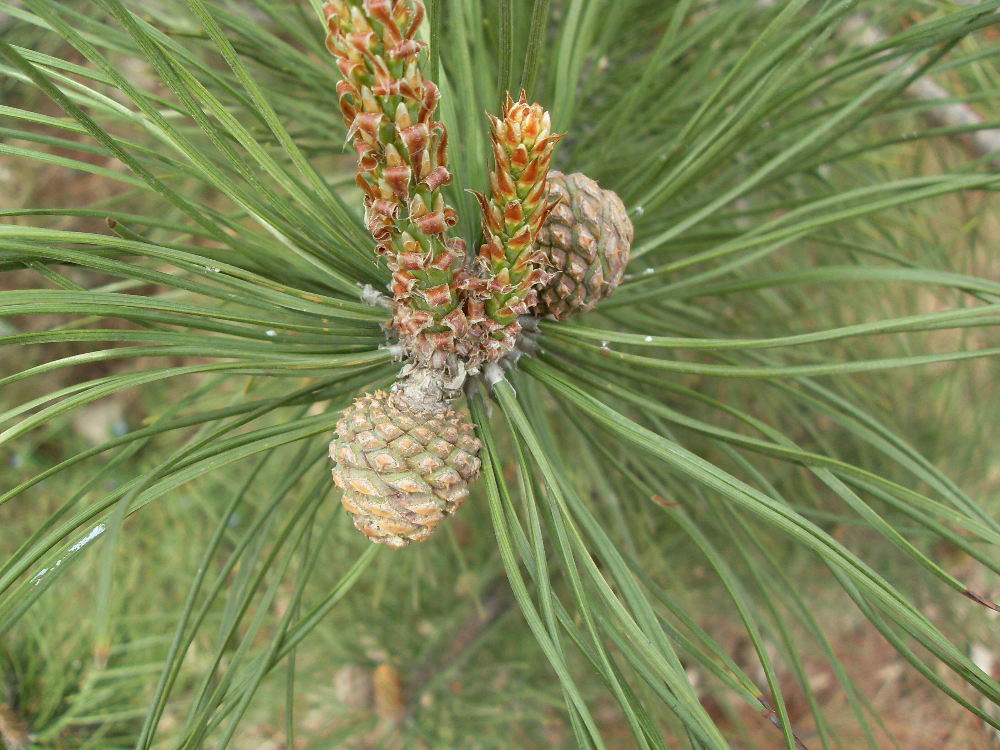
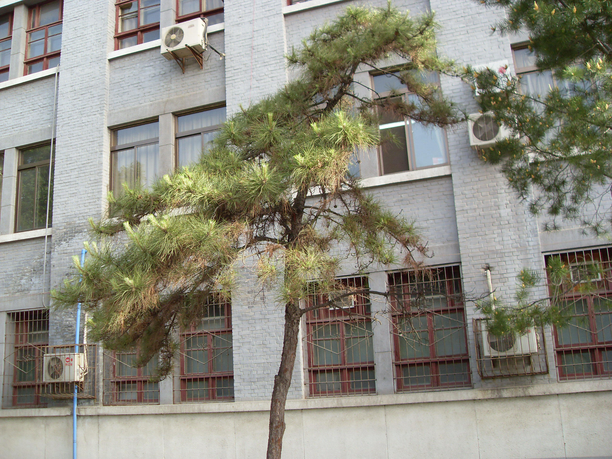

## 油松

---

**拉丁名:**  _Pinus tabulaeformis Carr_

**科 属:** 松科 松属

**别 名:** 短叶马尾松、东北黑松

**原产地:** 中国、朝鲜

**形  态:** 常绿乔木，高达25米，胸径约1米。树冠在壮年期呈塔形或广卵形，在老年呈盘状或伞形。树皮灰棕色，呈鳞片状裂开，裂缝红褐色。叶2针1束，长10～15厘米。雄球花橙红色，雌球雄花紫绿色。球果卵圆形，长4～9厘米。种子卵形，长6～8毫米。花期4～5月，果次年10月成熟。　　　　　　　　　　　　

**西大分布地:** 北校区聚集于物理系北侧行道两侧；南校区见学校外于绿化带及校内草坪各处。

**备注:** 右上图为油松单株树型，摄于2009年4月20日西北大学北校区物理系北侧行道旁；右下图为油松雄球花，摄于2009年4月6日西北大学南校区校外绿化带；左图为油松雌球花，摄于2009年4月6日西北大学南校区校外绿化带。　

.JPG) 

 

 

