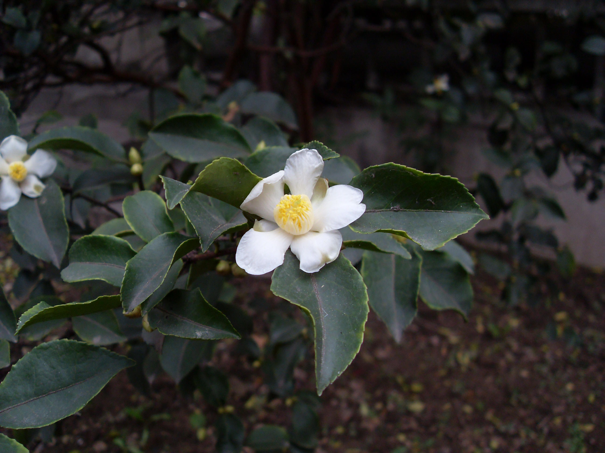

## 油茶

---

**拉丁名:**  _Camellia olefera Abel_

**科 属:** 山茶科 山茶属

**别 名:** 茶子树、白花茶

**原产地:** 中国

**形  态:** 常绿小乔木或灌木，高达7～8米，小枝有柔毛。叶革质，椭圆形表面无毛，叶柄有毛。花白色，顶生，单生或并生；花瓣5～7，分离，长2.5～4.5厘米，倒卵形之披针形；雄蕊外轮花丝仅基结合生。花期11～12月，果期次年秋季。

**西大分布地:** 仅在北校区生命科学学院南侧门前有一株。

**备注:** 2008年10月25日摄于西北大学北校区生命科学学院南侧门前。　

 

