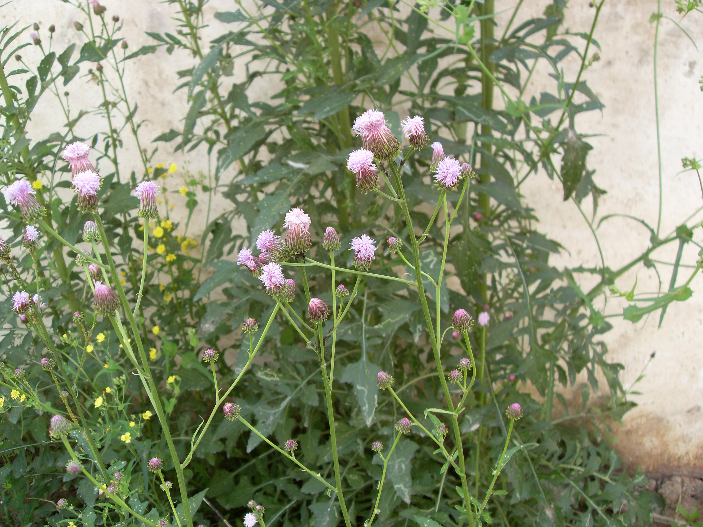

## 泥胡菜

---

**拉丁名:**  _Hemistepta lyrata (Bunge) Bunge _

**科 属:** 菊科 泥胡菜属

**别 名:** 花苦荬菜、剪刀草
【形  态】   二年生草本，高30～80厘米，具肉质圆锥形的根。茎直立
 ，具纵纹，光滑或有白色丝状毛。基生叶具柄，倒披针状椭圆形，长7～
 21厘米，羽状分裂，先端裂片较大，三角形，有时3裂，两侧裂片7～8对，
 长椭圆状倒披针形；中部叶椭圆形，先端渐尖，羽状分裂，无柄；上部叶
 线状披针形至线形。头状花序多数，总苞球形，长12～14毫米，宽18～22
 毫米；苞片5～8层，外层苞片卵形，中层苞片椭圆形，内层苞片线状披针形
 ，各层苞片背面尖端下具紫红色鸡冠状小片1枚。管状花紫红色，长13～14
 毫米。瘦果椭圆形。花期5～6月。
【西大分布地】南校区常见杂草，见于墙边荒地，草丛。
备注：
    2009年4月24日摄于西北大学南校区宿舍区
　
　

**原产地:** 泥胡菜
详细资料： 首页 下一页 上一页 
【拉丁名】Hemistepta lyrata (Bunge) Bunge 
【科 属】菊科 泥胡菜属
【别 名】花苦荬菜、剪刀草

**形  态:** 二年生草本，高30～80厘米，具肉质圆锥形的根。茎直立，具纵纹，光滑或有白色丝状毛。基生叶具柄，倒披针状椭圆形，长7～21厘米，羽状分裂，先端裂片较大，三角形，有时3裂，两侧裂片7～8对，长椭圆状倒披针形；中部叶椭圆形，先端渐尖，羽状分裂，无柄；上部叶线状披针形至线形。头状花序多数，总苞球形，长12～14毫米，宽18～22毫米；苞片5～8层，外层苞片卵形，中层苞片椭圆形，内层苞片线状披针形，各层苞片背面尖端下具紫红色鸡冠状小片1枚。管状花紫红色，长13～14毫米。瘦果椭圆形。花期5～6月。

**西大分布地:** 南校区常见杂草，见于墙边荒地，草丛。

**备注:** 2009年4月24日摄于西北大学南校区宿舍区　　

.JPG) 

 

