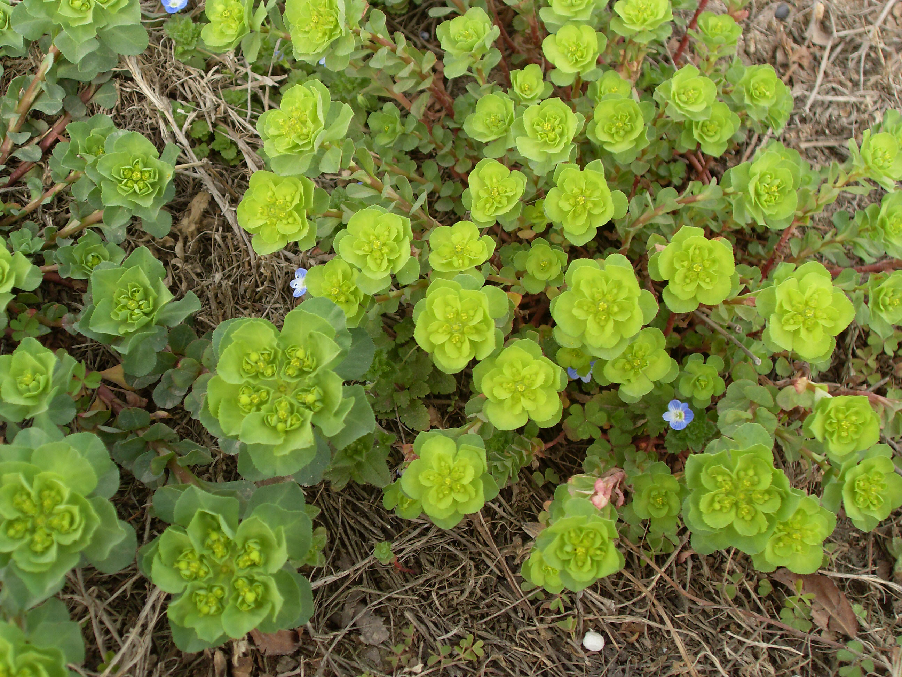
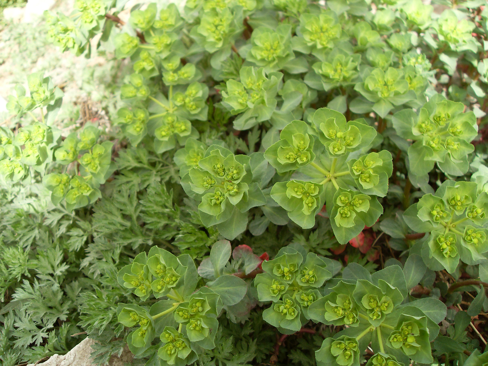

## 泽漆

---

**拉丁名:**  _Euphorbia helioscopia L_

**科 属:** 大戟科 大戟属

**别 名:** 猫儿眼

**原产地:** 不详

**形  态:** 两年生草本，具白色乳汁。茎基紫红色，上部淡绿，分枝斜上。叶互生，倒卵或匙形，先端钝圆或微凹缺，基部楔形，叶脉中部以上有细锯齿，茎顶具5片轮生叶状苞，与下部叶相似，但较大。多歧聚伞花序顶生，有5伞梗，每梗又生出3小伞梗，每小梗又分生为2叉；杯状花序钟形，总苞顶端浅裂；裂间腺体4肾形。蒴果光滑，种子卵形，长约2毫米，表面有凸起的网格。

**西大分布地:** 早春常见杂草，三校区均分布。

**备注:** 2009年3月12日摄于西北大学南校区东门附近草丛中。

 

 

