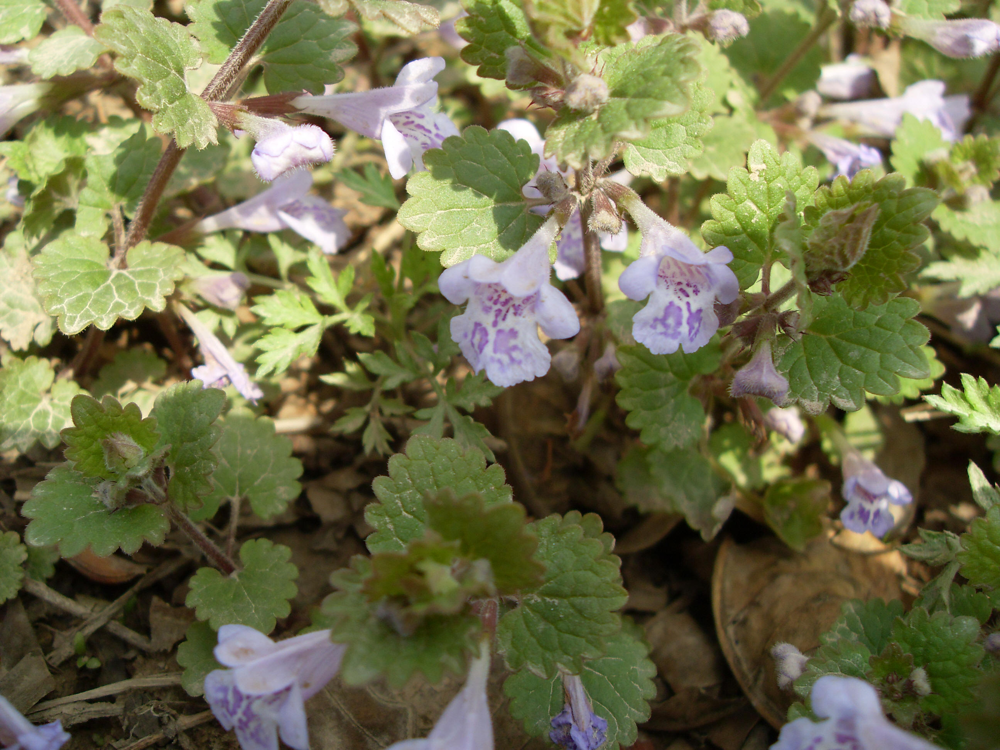
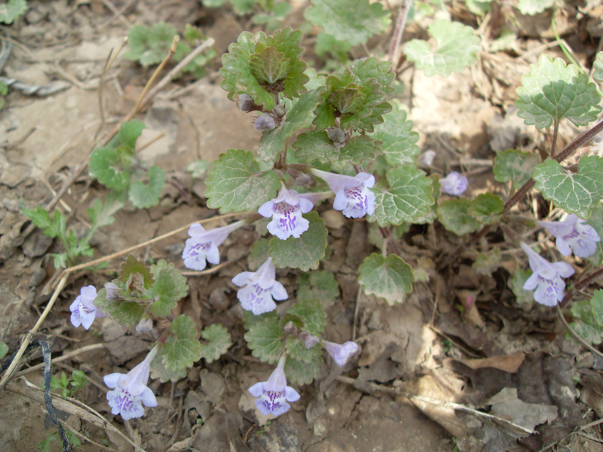

## 活血丹

---

**拉丁名:**  _Glechoma longituba (Nakai) Rupr_

**科 属:** 唇形科 活血丹属

**别 名:** 连钱草、破铜钱

**原产地:** 中国

**形  态:** 多年生上升草本，有匍匐茎，茎高10～20厘米，幼嫩部分被疏散的倒向的短柔毛。茎下部叶较小，心形或近肾形，上部叶较大，心形，长1.8～2.6厘米，上面被疏粗柔毛，下面常带紫色，被疏柔毛；叶柄长为叶片1～2倍轮散花序少花，花萼筒状，5齿，长披针形，顶端芒状，呈3/2二唇形，上唇三齿较长；花冠淡蓝色至紫色，下唇有深色斑点。小坚果矩圆状卵形。花期6～8月，果期7～9月。

**西大分布地:** 仅分布于北校区西大花园内。

**备注:** 2009年3月23日摄于西北大学北校区西大花园内。

 

 

