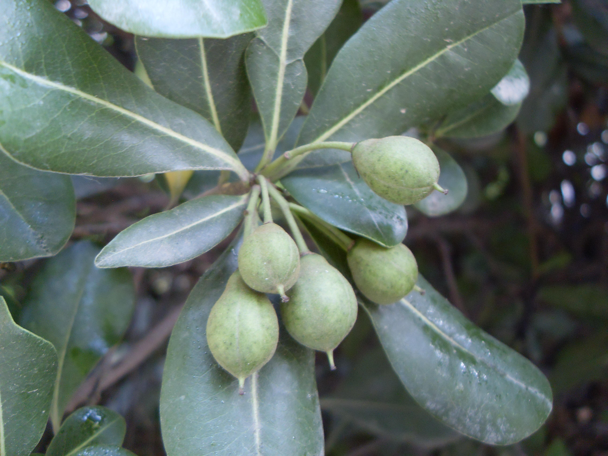

## 海桐

---

**拉丁名:**  _Pittosporum tobira (Thunb.) Ait_

**科 属:** 海桐科 海桐属

**别 名:** 山矾花、七里香

**原产地:** 中国

**形  态:** 常绿灌木或小乔木，高2～6米，树冠圆球形。叶革质，倒卵状椭圆形，长5～12厘米，先端圆钝或微凹，基部楔形，边缘反卷，全缘，无毛，表面深绿而有光泽。顶生伞房花序，花白色或淡黄绿色，径约1厘米，芳香。蒴果卵球形，长1～1.5厘米，有棱角，熟时3瓣裂；种子鲜红色，花期5月，果期10月。　　　　　　

**西大分布地:** 北校区见于图书馆前、物理系东侧、生科院后及化学系南侧；

**备注:** 海桐详细资料:首页下一页上一页【拉丁名】Pittosporumtobira(Thunb.)Ait.【科属】海桐科海桐属【别名】山矾花、七里香【原产地】中国【形态】常绿灌木或小乔木，高2～6米，树冠圆球形。叶革质，倒卵状椭圆形，长5～12厘米，先端圆钝或微凹，基部楔形，边缘反卷，全缘，无毛，表面深绿而有光泽。顶生伞房花序，花白色或淡黄绿色，径约1厘米，芳香。蒴果卵球形，长1～1.5厘米，有棱角，熟时3瓣裂；种子鲜红色，花期5月，果期10月。　　　　　　【西大分布地】北校区见于图书馆前、物理系东侧、生科院后及化学系南侧；备注:上图为海桐花枝，2009年4月23日摄于西北大学北校区生命科学学院楼后；左图为海桐果实，2009年7月5日摄于西北大学北校区图书馆前。　

.JPG) 

 

