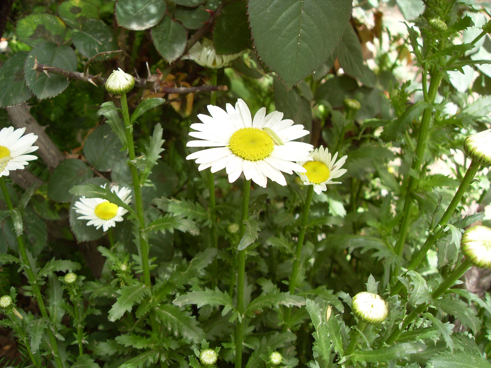

## 滨菊

---

**拉丁名:**  _Leucanthemum vulgare Lam_

**科 属:** 菊科 春黄菊族 滨菊属

**别 名:** 牛眼菊、春白菊、法兰西菊

**原产地:** 欧洲及亚洲

**形  态:** 多年生草本，高15～80厘米。茎直立，通常不分枝，被绒毛或卷毛至无毛。基生叶花期生存，长椭圆形、倒披针形、倒卵形或卵形，长3～8厘米，宽1.5～2.5厘米，基部楔形，渐狭成长柄，柄长于叶片自身，边缘圆或钝锯齿。中下部茎叶长椭圆形或线状长椭圆形，向基部收窄，耳状或近耳状扩大半抱茎，中部以下或近基部有时羽状浅裂。上部叶渐小，有时羽状全裂。头状花序单生茎顶，有长花梗，或茎生2～5个头状花序，排成疏松伞房状。总苞径10～20毫米。全部苞片无毛，边缘白色或褐色腆质。舌片长10～25毫米。瘦果长2～3毫米。花果期5～10月。

**西大分布地:** 仅见于北校区西大花园内。

**备注:** 2009年4月20日摄于西北大学北校区西大花园内。　

.JPG) 

 

