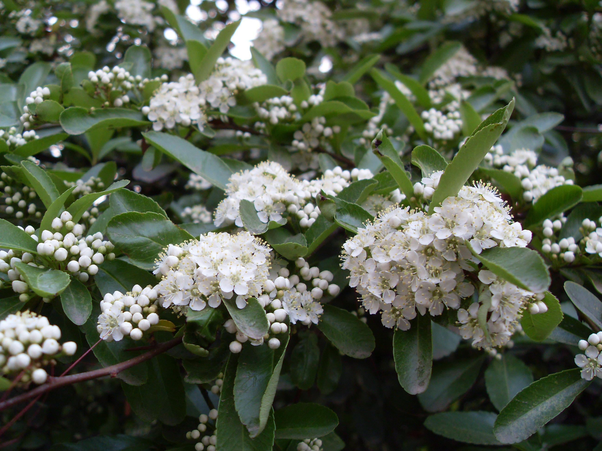

## 火棘

---

**拉丁名:**  _Pyracantha fortuneana_

**科 属:** 蔷薇科 火棘属

**别 名:** 救军粮，火把树

**原产地:** 中国

**形  态:** 常绿灌木，高约3米。枝拱形下垂，短侧枝刺状。叶倒卵形至倒卵状长椭圆形，长1.5～6厘米先端圆钝微凹，基部楔形，缘有圆钝锯齿，齿尖内弯，近基部全缘，两面无毛。花白色，径约1厘米，复伞房花序，花期5月。果近球形，红色，径约5毫米，果期9～10月。

**西大分布地:** 北校区分布于西门口两侧花坛，图书馆周边;南校区见于音乐广场南侧　　　

**备注:** 上图为火棘果枝，2008年10月21日摄于西北大学北校区西门口花坛。左图为火棘花枝，2009年4月28日摄于西北大学北校区图书馆前。

 

 

