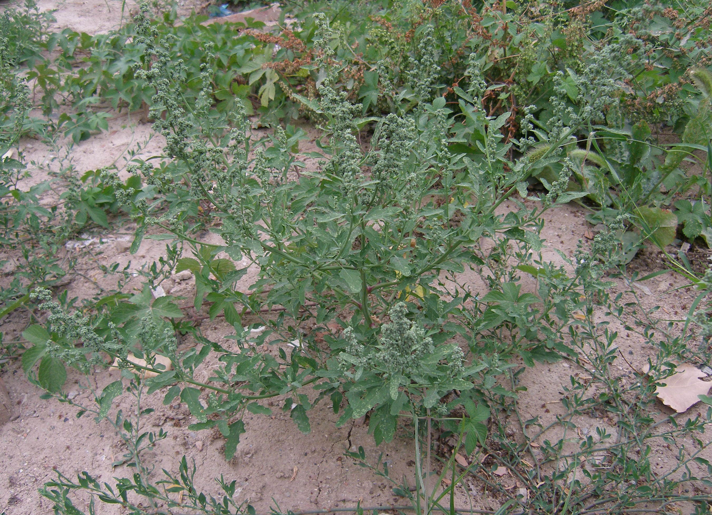

## 灰菜

---

**拉丁名:**  _Chenopodium album Linn_

**科 属:** 藜科 藜属

**别 名:** 藜、灰灰菜
【形  态】一年生草本。高30～150厘米。茎直立，粗壮，
 有条棱及绿色或紫红色色条，多分枝；枝斜生或开展。叶
 菱状卵形至宽披针形，长3～6厘米，先端急尖或微钝，表面
 有粉。花两性，花簇生于枝上部排列成穗形圆锥状花序。种
 皮与果皮贴生。种子横生，黑色有光泽。花果期5～10月。
【西大分布地】三校区常见杂草，见于各处。
备注：
    该图为李智选老师2006年6月5日摄于西北大学桃园校区。

**原产地:** 灰 菜
详细资料： 首页 下一页上一页
【拉丁名】Chenopodium album Linn.
【科 属】藜科 藜属
【别 名】藜、灰灰菜

**形  态:** 一年生草本。高30～150厘米。茎直立，粗壮，有条棱及绿色或紫红色色条，多分枝；枝斜生或开展。叶菱状卵形至宽披针形，长3～6厘米，先端急尖或微钝，表面有粉。花两性，花簇生于枝上部排列成穗形圆锥状花序。种皮与果皮贴生。种子横生，黑色有光泽。花果期5～10月。

**西大分布地:** 三校区常见杂草，见于各处。

**备注:** 该图为李智选老师2006年6月5日摄于西北大学桃园校区。

 

