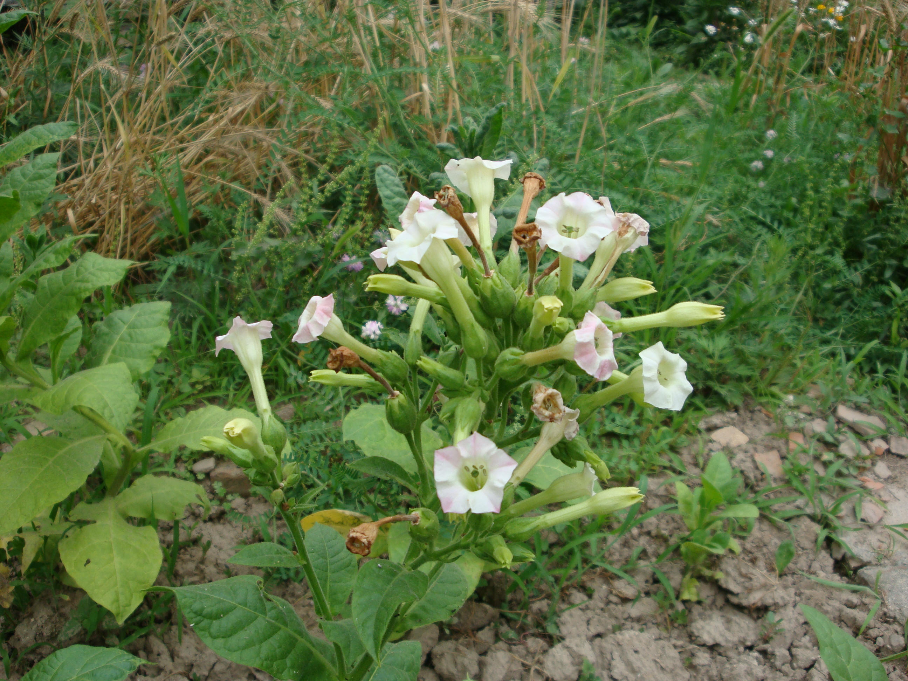

## 烟草

---

**拉丁名:**  _Nicotiana tabacum Linn _

**科 属:** 茄科 烟草属

**别 名:** 烟叶
 【原产地】美洲、大洋洲
 【形  态】一年生或限多年生草本。全株被腺毛，根粗壮，
  茎高0.7～2米，基部稍木质化。叶矩圆状披针形、披针形
  、矩圆形或卵形，长10～30（70）厘米，先端渐尖，基部
  渐狭至茎成耳状而半抱茎；叶柄不明显。花序圆锥状，多
  花，顶生，花萼筒状或筒状钟形；花冠漏斗状，淡红色。蒴
  果卵形或矩圆形。种子圆形或阔矩圆形，褐色。花期6～9月
  ，果期7～10月。
 【西大分布地】仅见于北校区西大花园内。
备注：
    2009年6月15日摄于西北大学北校区西大花园内。
　

**原产地:** 美洲、大洋洲
【形 态】一年生或限多年生草本。全株被腺毛，根粗壮，
 茎高0.7～2米，基部稍木质化。叶矩圆状披针形、披针形
 、矩圆形或卵形，长10～30（70）厘米，先端渐尖，基部
 渐狭至茎成耳状而半抱茎；叶柄不明显。花序圆锥状，多
 花，顶生，花萼筒状或筒状钟形；花冠漏斗状，淡红色。蒴
 果卵形或矩圆形。种子圆形或阔矩圆形，褐色。花期6～9月
 ，果期7～10月。
【西大分布地】仅见于北校区西大花园内。
备注：
 2009年6月15日摄于西北大学北校区西大花园内。
　

**形  态:** 一年生或限多年生草本。全株被腺毛，根粗壮，茎高0.7～2米，基部稍木质化。叶矩圆状披针形、披针形、矩圆形或卵形，长10～30（70）厘米，先端渐尖，基部渐狭至茎成耳状而半抱茎；叶柄不明显。花序圆锥状，多花，顶生，花萼筒状或筒状钟形；花冠漏斗状，淡红色。蒴果卵形或矩圆形。种子圆形或阔矩圆形，褐色。花期6～9月，果期7～10月。

**西大分布地:** 仅见于北校区西大花园内。

**备注:** 2009年6月15日摄于西北大学北校区西大花园内。　

.JPG) 

 

