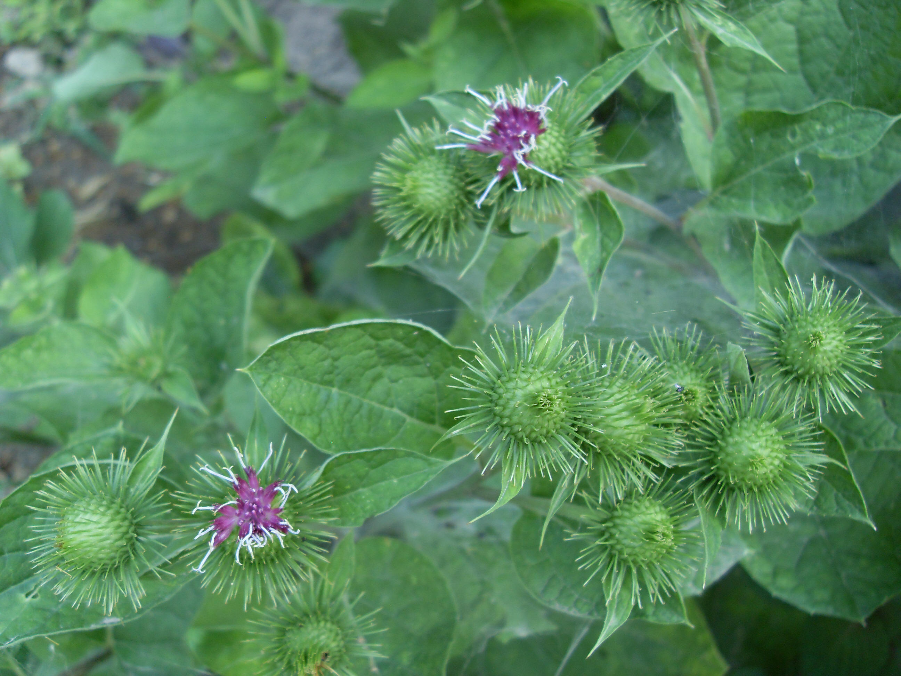

## 牛蒡

---

**拉丁名:**  _Arctium lappa Linn.  _

**科 属:** 菊科 菜蓟族 牛蒡属

**别 名:** 大力子、恶实
 【原产地】中国
 【形  态】两年生草本，高1～2米。根肉质，茎粗壮，带紫色
  ，有微毛，上部多分枝。基生叶丛生，茎生叶互生，宽卵形或
  心形，长40～50厘米，表面绿色无毛，背面密被灰色柔毛。全缘
  ，先端圆钝，基部心形，有柄，上部叶渐小。头状花序丛生或
  排成伞房状，直径3～4厘米；花全部筒状，淡紫色。瘦果椭圆形
  或倒卵形，灰黑色，有冠毛。花果期7～10月。
 【西大分布地】仅见于北校区西大花园内。
备注：
    2009年7月5日摄于西北大学北校区西大花园内。

**原产地:** 中国
 【形 态】两年生草本，高1～2米。根肉质，茎粗壮，带紫色
 ，有微毛，上部多分枝。基生叶丛生，茎生叶互生，宽卵形或
 心形，长40～50厘米，表面绿色无毛，背面密被灰色柔毛。全缘
 ，先端圆钝，基部心形，有柄，上部叶渐小。头状花序丛生或
 排成伞房状，直径3～4厘米；花全部筒状，淡紫色。瘦果椭圆形
 或倒卵形，灰黑色，有冠毛。花果期7～10月。
【西大分布地】仅见于北校区西大花园内。
备注：
 2009年7月5日摄于西北大学北校区西大花园内。

**形  态:** 两年生草本，高1～2米。根肉质，茎粗壮，带紫色，有微毛，上部多分枝。基生叶丛生，茎生叶互生，宽卵形或心形，长40～50厘米，表面绿色无毛，背面密被灰色柔毛。全缘，先端圆钝，基部心形，有柄，上部叶渐小。头状花序丛生或排成伞房状，直径3～4厘米；花全部筒状，淡紫色。瘦果椭圆形或倒卵形，灰黑色，有冠毛。花果期7～10月。

**西大分布地:** 仅见于北校区西大花园内。

**备注:** 2009年7月5日摄于西北大学北校区西大花园内。

 

