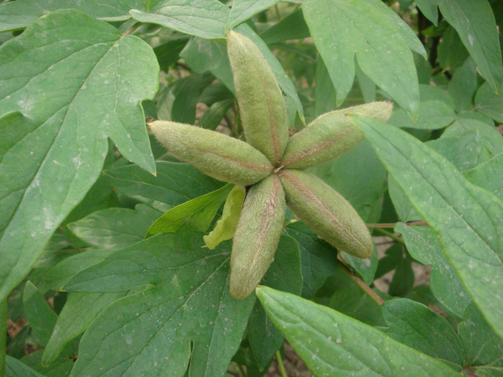

## 牡丹

---

**拉丁名:**  _Paeonia suffruticosa Andr.                    (1                                          (2  _

**科 属:** 芍药科 芍药属

**别 名:** 木芍药、洛阳花、花王

**原产地:** 中国西北部

**形  态:** 落叶小灌木，高达2米。枝多而粗壮。叶呈二回羽状复叶，小叶长4.5～8厘米阔卵形至卵状长椭圆形，先端3～5裂，基部全缘，叶被有白粉，平滑无毛。花单生枝顶大型，径10～30厘米，花形多样，花色丰富。花后结成蓇葖果，密生短柔毛，成熟时开裂，内藏5～15枚大粒种子，(3(4呈不规则的圆形，褐色或黑色。花期4～5月，果期7～8月。

**西大分布地:** 北校区见于图书馆前花坛内及宝际寺遗址亭 周围； 南校区见于中央报告厅楼顶； 桃园校区见于教工家属区北门处。

**备注:** 图(1)为牡丹一荷花型浅红色品种，2009年4月10日摄于西北大学北校区图书馆前；(5(6图(2)为牡丹一皇冠型粉白色品种，2009年4月10日摄于西北大学北校区图书馆前；图(3)为牡丹一单瓣白色品种，2009年4月10日摄于西北大学北校区宝际寺遗址亭前；图(4)为一白色紫斑牡丹品种，2009年4月10日摄于西北大学北校区图书馆前；图(5)为牡丹一托桂型白色品种，2009年4月10日摄于西北大学北校区图书馆前；(7(8图(6)为牡丹一皇冠型浅红色品种，2009年4月10日摄于西北大学北校区图书馆前；图(7)为牡丹一蔷薇型红色品种，2009年4月12日摄于西北大学南校区中央报告厅楼顶；图(8)为牡丹一金环型紫色品种，2009年4月10日摄于西北大学北校区图书馆前；图(9)为牡丹一菊花型粉红色品种，2009年4月12日摄于西北大学南校区中央报告厅楼顶。(9(10图(10)为牡丹果实——聚合蓇葖果，2009年5月日摄于西北大学北校区宝际寺遗址亭前。　　　

 

